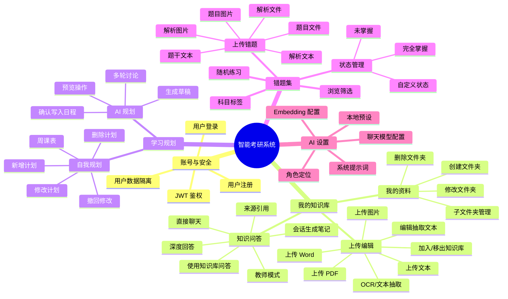
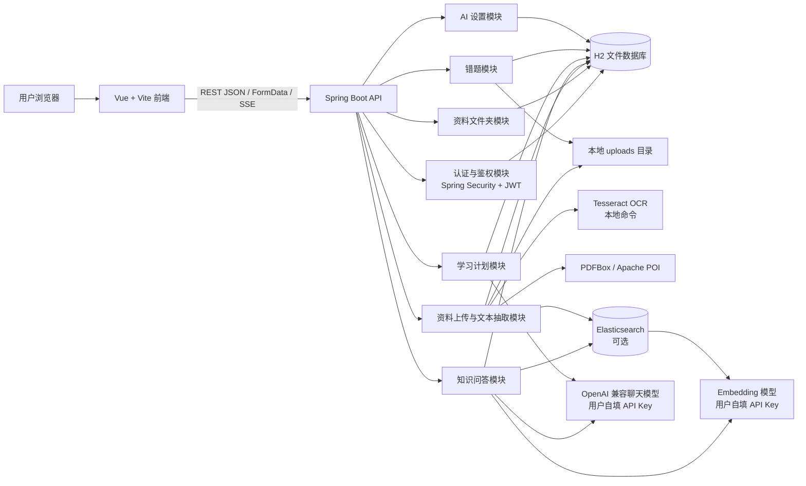
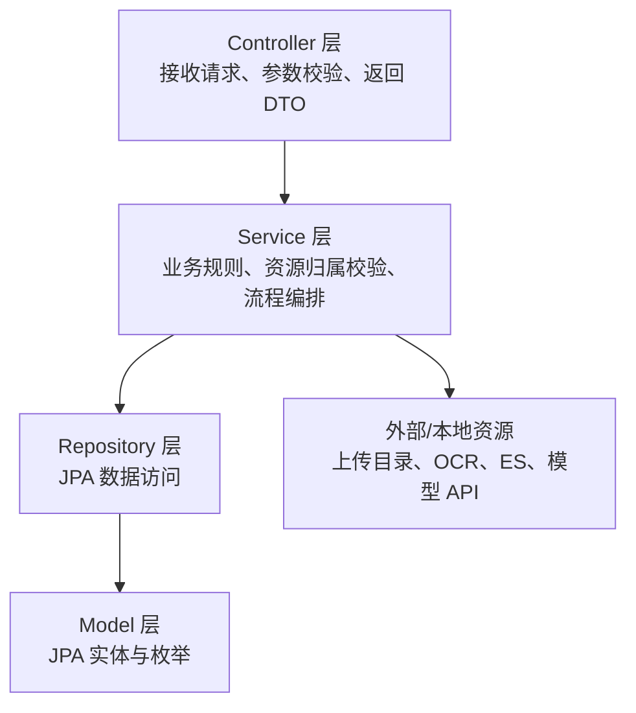
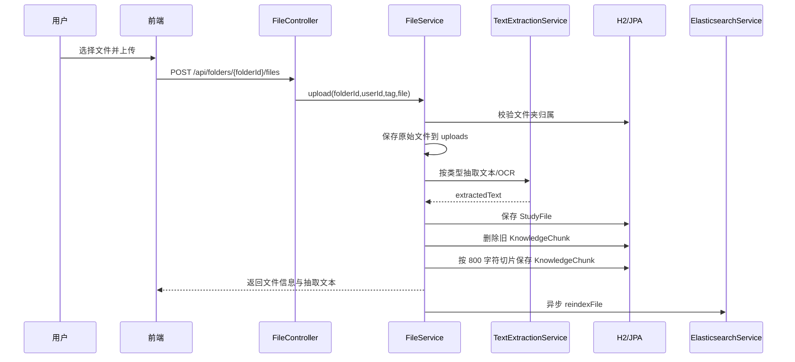
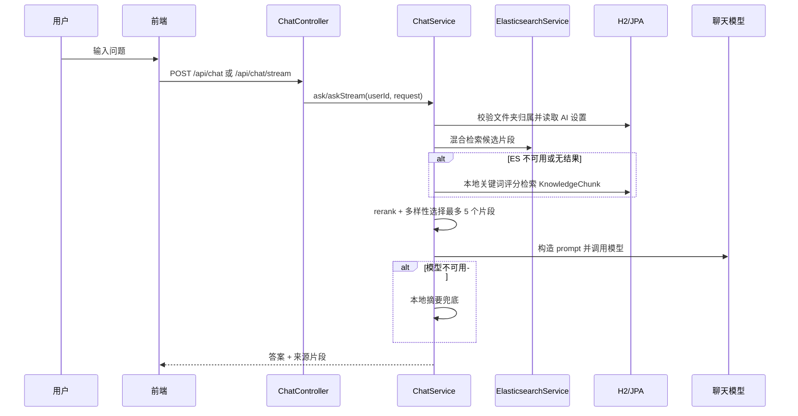
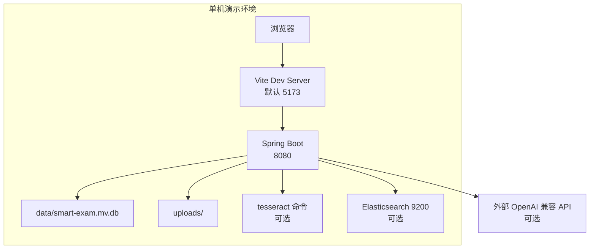
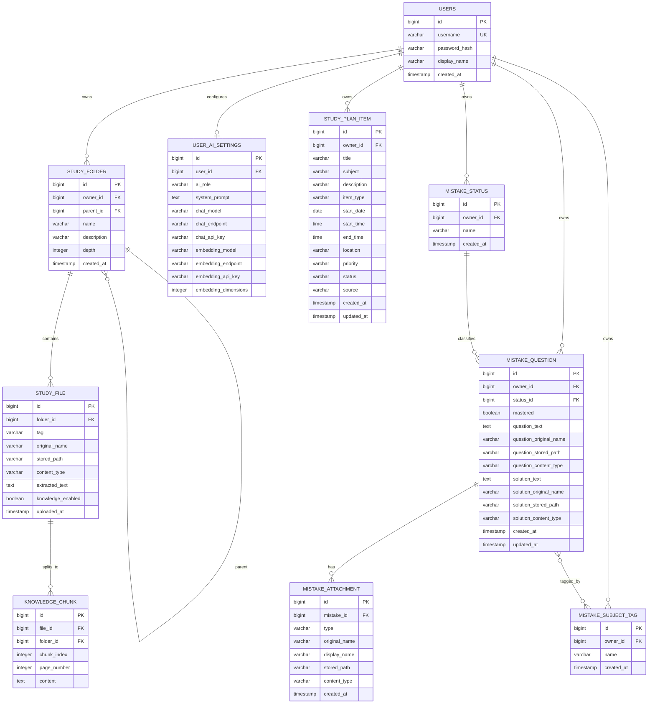

# 智能考研系统系统架构书

## 1. 文档目的

本文描述智能考研系统的总体技术架构、技术栈、功能导图、系统架构图、主要模块关系和 ER 图。内容依据当前项目代码编写，适用于开发、答辩和后续维护。

## 2. 技术栈

| 层次 | 技术 | 当前项目位置 |
| --- | --- | --- |
| 前端框架 | Vue 3.5.12 | `frontend/src/App.vue` |
| 构建工具 | Vite 5.4.10 | `frontend/vite.config.js` |
| 前端图标 | lucide-vue-next | `frontend/package.json` |
| 后端框架 | Spring Boot 3.3.5 | `backend/pom.xml` |
| Web API | Spring MVC | `controller` 包 |
| 安全认证 | Spring Security + JWT | `security`、`config` 包 |
| ORM | Spring Data JPA / Hibernate | `repository`、`model` 包 |
| 数据库 | H2 文件数据库 | `application.yml` |
| 文件抽取 | PDFBox、Apache POI、Tesseract OCR | `TextExtractionService` |
| AI 调用 | Java HttpClient + OpenAI 兼容接口 | `ChatService`、`StudyPlanAiService`、`EmbeddingService` |
| 检索服务 | Elasticsearch，可选 | `ElasticsearchService` |
| 文件存储 | 本地上传目录 `./uploads` | `application.yml` |

## 3. 功能导图

## 4. 系统总体架构图

## 5. 后端分层架构

主要包说明：

| 包 | 职责 |
| --- | --- |
| `controller` | 暴露 REST API，包含认证、文件夹、文件、问答、计划、错题、AI 设置接口 |
| `service` | 实现业务流程和资源归属校验 |
| `repository` | JPA Repository，负责数据库查询 |
| `model` | 用户、资料、错题、计划、AI 配置等实体 |
| `dto` | 请求和响应对象 |
| `security` | JWT 生成、解析、过滤器和认证主体 |
| `config` | Spring Security 配置 |

## 6. 核心业务流程架构

### 6.1 资料入库流程

### 6.2 知识问答流程

## 7. 部署视图

## 8. ER 图

## 9. 主要接口分组

| 模块 | 接口前缀 | 说明 |
| --- | --- | --- |
| 认证 | `/api/auth` | 注册、登录 |
| 文件夹 | `/api/folders` | 文件夹增删改查 |
| 文件 | `/api/folders/{folderId}/files`、`/api/files` | 文件上传、查看、编辑、移动、删除、知识库状态 |
| 问答 | `/api/chat` | 普通问答、流式问答、会话生成笔记 |
| AI 设置 | `/api/ai-settings` | 读取和保存用户模型配置 |
| 学习计划 | `/api/study-plan` | 计划 CRUD、AI 规划讨论、生成、应用 |
| 错题 | `/api/mistakes` 等 | 错题、状态、标签、附件、练习 |

## 10. 架构特点与限制

架构特点：

- 前后端分离，接口边界清晰。
- 服务层统一进行用户资源归属校验，避免越权访问。
- 知识库问答采用“检索后生成”，支持来源引用。
- AI 与 Elasticsearch 均有降级路径，便于本地演示。
- 错题和学习计划模块与知识库模块相互独立，降低耦合。

当前限制：

- 默认 H2 数据库和本地上传目录不适合多人生产环境。
- API Key 以用户配置形式保存，生产环境应增加加密存储。
- 当前未实现管理员角色、班级/团队协作和多端同步。
- Elasticsearch 与 Tesseract 需要运行环境额外安装。
