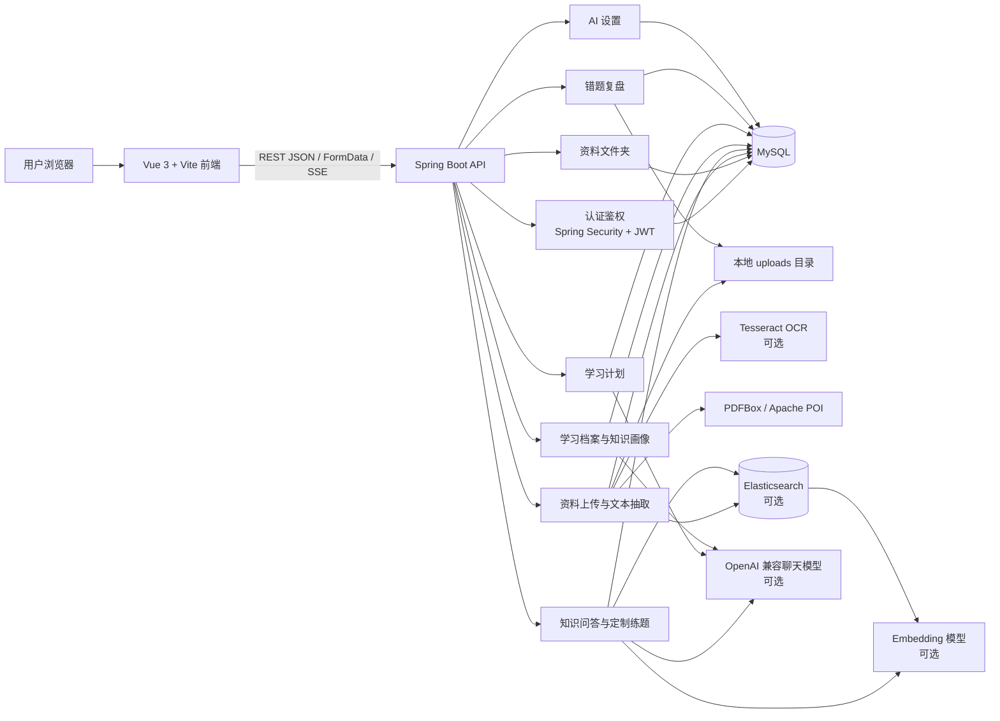
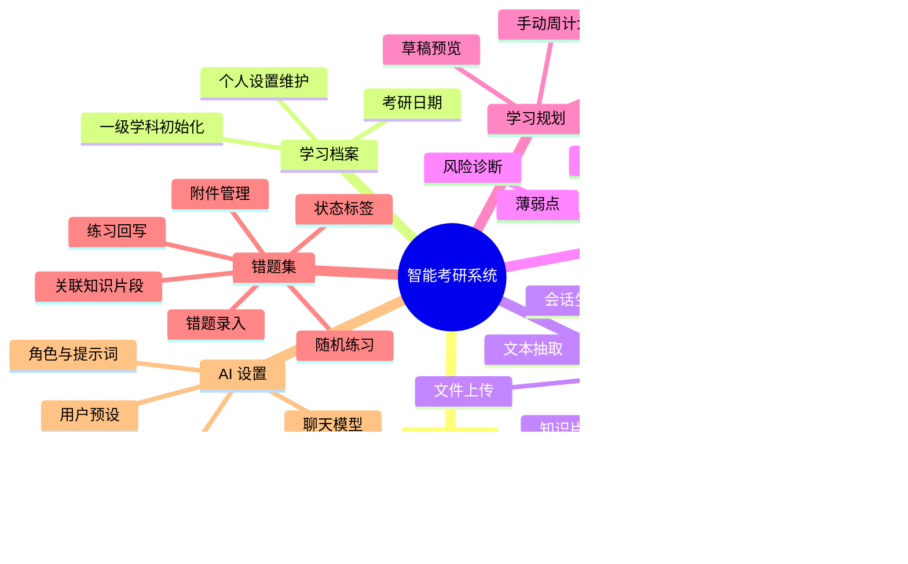
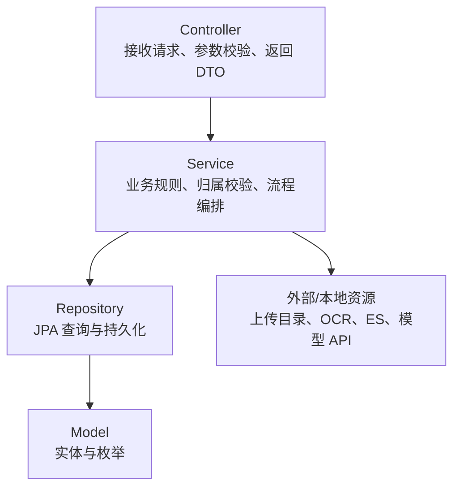
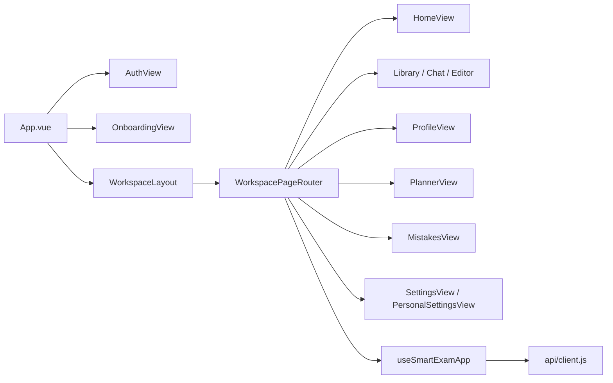
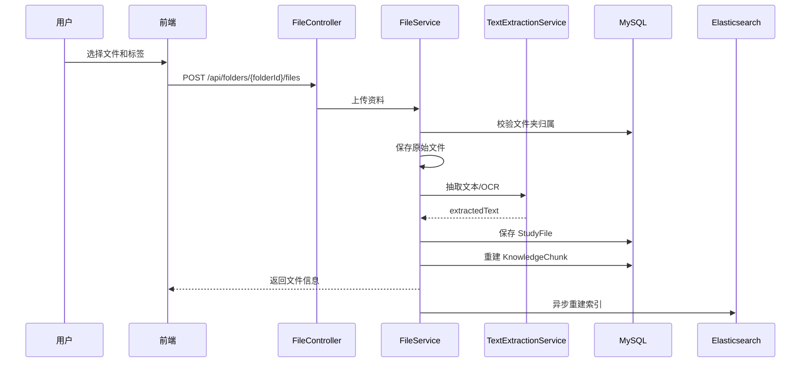
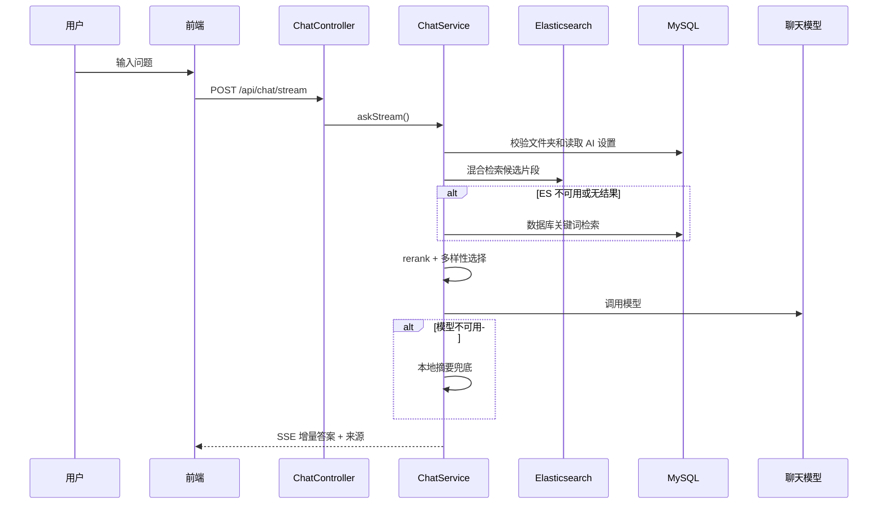
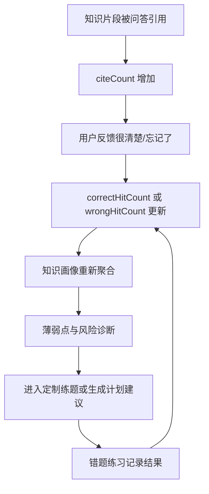
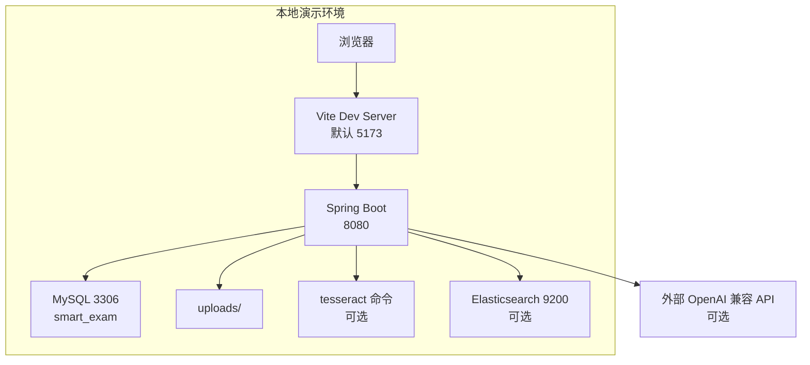
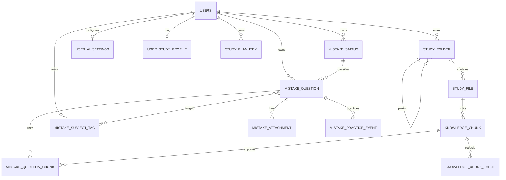

# 智能考研系统系统架构书

## 1. 文档目的

本文描述智能考研系统的总体架构、技术栈、模块关系、部署视图和主要数据模型。文档依据当前项目代码编写，用于毕业设计答辩、开发维护和后续扩展参考。

## 2. 总体架构

系统采用前后端分离、后端分层、关系型数据库持久化、本地文件存储和可选 AI/检索增强的架构。

核心设计思想是：基础功能不依赖外部模型即可运行，AI、Embedding 和 Elasticsearch 作为增强能力接入；当增强服务不可用时，系统回退到数据库检索、本地摘要或用户提示。

## 3. 技术栈

| 层次 | 技术 | 项目位置 |
| --- | --- | --- |
| 前端框架 | Vue 3.5.12 | `frontend/src` |
| 构建工具 | Vite 5.4.10 | `frontend/vite.config.js` |
| 图表 | ECharts 5 | 知识画像页面 |
| 图标 | lucide-vue-next | 前端组件 |
| 后端框架 | Spring Boot 3.3.5 | `backend/pom.xml` |
| Web 接口 | Spring MVC | `controller` 包 |
| 安全 | Spring Security + JWT + BCrypt | `config`、`security` 包 |
| ORM | Spring Data JPA / Hibernate | `model`、`repository` 包 |
| 数据库 | MySQL 8.x | `application.yml` |
| 文件解析 | PDFBox、Apache POI | `TextExtractionService` |
| OCR | Tesseract 命令行 | `TextExtractionService` |
| AI 调用 | Java HttpClient + OpenAI 兼容接口 | `ChatService`、`StudyPlanAiService`、`EmbeddingService` |
| 检索 | Elasticsearch，可选 | `ElasticsearchService` |

## 4. 功能架构

## 5. 后端分层架构

| 包 | 职责 |
| --- | --- |
| `controller` | 暴露认证、学习档案、知识画像、文件夹、文件、问答、计划、错题、AI 设置接口 |
| `service` | 实现核心业务流程、资源归属校验、AI/ES/OCR 调用和降级逻辑 |
| `repository` | JPA Repository，封装数据访问 |
| `model` | 用户、资料、知识片段、错题、计划、AI 设置等实体 |
| `dto` | 请求和响应对象 |
| `security` | JWT 生成解析、认证主体和过滤器 |
| `config` | 安全配置、演示数据初始化等 |

## 6. 前端架构

前端是单页应用，`App.vue` 根据登录态和学习档案初始化状态切换三类界面：未登录显示 `AuthView`，未完成学习档案显示 `OnboardingView`，已完成初始化后进入 `WorkspaceLayout`。

主要状态和业务方法集中在 `frontend/src/composables/useSmartExamApp.js`，API 请求集中在 `frontend/src/api/client.js`。工作台通过 `WorkspacePageRouter.vue` 切换首页、知识库、知识画像、学习规划、错题集、个人设置和 AI 设置。

## 7. 核心业务流程

### 7.1 资料入库流程

### 7.2 知识问答流程

### 7.3 学习闭环流程

## 8. 部署视图

后端默认端口为 8080，前端通过 `VITE_API_BASE` 指定后端 API 地址。MySQL 默认库名为 `smart_exam`。生产部署时应替换 JWT Secret、数据库账号密码和模型密钥管理方式。

## 9. 数据架构

主要实体包括：

| 实体 | 说明 |
| --- | --- |
| `User` | 用户账号、密码哈希、昵称和创建时间 |
| `UserStudyProfile` | 考研日期、是否完成初始化、学科数量 |
| `StudyFolder` | 资料文件夹，支持父子层级、学科文件夹标记和排序 |
| `StudyFile` | 上传资料元信息、标签、抽取文本和知识库状态 |
| `KnowledgeChunk` | 知识片段、页码、切片版本、引用/反馈/练习统计 |
| `KnowledgeChunkEvent` | chunk 引用、正确反馈、错误反馈事件 |
| `UserAiSettings` | 用户级 AI 角色、提示词、聊天模型、Embedding 模型和预设 |
| `StudyPlanItem` | 学习计划项，支持类型、时间、优先级、状态和来源 |
| `MistakeQuestion` | 错题主表，保存题干、解析、掌握状态和附件文件信息 |
| `MistakeAttachment` | 错题题目/解析图片附件 |
| `MistakeQuestionChunk` | 错题和知识片段的关联 |
| `MistakePracticeEvent` | 错题练习结果事件 |

## 10. 接口分组

| 模块 | 接口前缀 | 说明 |
| --- | --- | --- |
| 认证 | `/api/auth` | 注册、登录 |
| 学习档案 | `/api/study-profile` | 初始化、读取、更新考研日期和学科 |
| 文件夹 | `/api/folders` | 文件夹增删改查 |
| 文件 | `/api/folders/{folderId}/files`、`/api/files/{fileId}` | 上传、查看、编辑、移动、删除、知识库状态 |
| 问答 | `/api/chat` | 普通问答、流式问答、定制练题、来源反馈、会话笔记 |
| 知识画像 | `/api/knowledge-profile` | 总览、学科、文件、薄弱点、趋势、风险、诊断、chunk 搜索 |
| AI 设置 | `/api/ai-settings` | 用户模型配置和预设 |
| 学习计划 | `/api/study-plan` | 计划 CRUD、画像建议、AI 规划讨论、生成、应用 |
| 错题 | `/api/mistakes`、`/api/mistake-*` | 错题、状态、标签、附件、随机练习、练习结果 |

## 11. 架构特点与限制

架构特点：

- 前后端职责清晰，API 边界集中。
- 基础功能可本地运行，AI、Embedding、ES 均可降级。
- 数据模型围绕用户隔离，服务层进行资源归属校验。
- 知识问答采用检索增强生成，并保留来源片段。
- 学习画像、定制练题、错题练习和学习计划构成闭环。

当前限制：

- 尚未实现管理员角色、多人协作、班级管理和正式考试判分。
- API Key 的生产级加密存储仍需增强。
- 本地文件存储适合单机演示，生产环境需要备份和对象存储方案。
- Elasticsearch、Tesseract、外部模型接口需要额外安装或配置。
