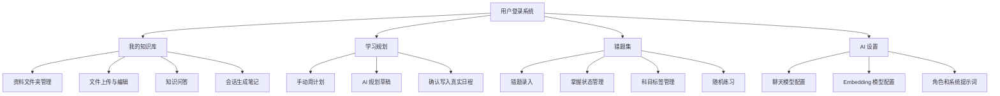

# 智能考研系统软件需求说明书

## 1. 引言

### 1.1 编写目的

本文档说明智能考研系统的软件需求，包括功能需求、性能需求、用户界面需求、运行环境、数据逻辑和数据采集要求。本文档依据当前项目实现编写，作为开发、测试、验收和维护的依据。

### 1.2 项目范围

系统面向个人考研学习者，提供资料知识库、智能问答、错题复盘、学习计划和 AI 参数配置。系统不包含管理员后台、多人协作、支付、正式考试判分、课程售卖等功能。

### 1.3 用户角色

当前系统只有一种业务用户：普通学习用户。

普通学习用户可以注册、登录、管理自己的资料文件夹和文件、提问、管理错题、安排计划、配置 AI 参数。系统通过 JWT 和资源归属校验隔离不同用户数据。

## 2. 总体描述

### 2.1 产品功能概述

### 2.2 运行环境

| 项 | 要求 |
| --- | --- |
| 操作系统 | Windows、macOS、Linux 均可，当前开发环境为 Windows |
| JDK | Java 21 |
| 后端 | Maven + Spring Boot |
| 前端 | Node.js/npm，Vue + Vite |
| 数据库 | H2 文件数据库，默认路径 `backend/data/smart-exam` |
| 浏览器 | 支持现代 JavaScript 的 Chrome、Edge 等浏览器 |
| 可选服务 | Tesseract OCR、Elasticsearch、OpenAI 兼容模型接口 |

### 2.3 约束

- 用户必须登录后才能访问业务功能。
- 文件必须上传到已存在且属于当前用户的文件夹。
- 使用知识库问答时，必须选择文件夹；关闭知识库后可直接聊天。
- OCR 依赖本机 `tesseract` 命令。
- AI 问答质量依赖用户配置的模型服务；未配置 Key 时只提供有限兜底。

## 3. 功能需求

### 3.1 用户认证

| 编号 | 需求 |
| --- | --- |
| FR-AUTH-01 | 用户可以输入用户名、密码和可选昵称进行注册 |
| FR-AUTH-02 | 用户可以使用用户名和密码登录 |
| FR-AUTH-03 | 登录成功后前端保存 token 和用户信息 |
| FR-AUTH-04 | 后端对业务 API 校验 `Authorization: Bearer <token>` |
| FR-AUTH-05 | 用户可以退出登录，前端清理本地会话 |

### 3.2 资料文件夹管理

| 编号 | 需求 |
| --- | --- |
| FR-FOLDER-01 | 用户可以查看自己的全部资料文件夹 |
| FR-FOLDER-02 | 用户可以在根目录或已有文件夹下创建子文件夹 |
| FR-FOLDER-03 | 文件夹保存名称、描述、父文件夹、层级深度、创建时间 |
| FR-FOLDER-04 | 系统限制文件夹最大深度为 3 级 |
| FR-FOLDER-05 | 用户可以修改文件夹名称和描述 |
| FR-FOLDER-06 | 用户可以删除自己的文件夹；删除规则以服务层实际校验为准 |

### 3.3 资料文件管理与文本抽取

| 编号 | 需求 |
| --- | --- |
| FR-FILE-01 | 用户可以在当前文件夹上传文件 |
| FR-FILE-02 | 上传时可选择文件标签：教材、资料、笔记、习题、其他 |
| FR-FILE-03 | 系统保存原文件名、存储路径、内容类型、上传时间 |
| FR-FILE-04 | 系统自动抽取 PDF、Word、图片、文本/Markdown 内容 |
| FR-FILE-05 | 图片 OCR 使用本地 Tesseract |
| FR-FILE-06 | 抽取失败或不支持时，系统提示用户，用户可手动补充文本 |
| FR-FILE-07 | 用户可以编辑抽取文本并保存 |
| FR-FILE-08 | 用户可以修改资料显示名称，保留原扩展名 |
| FR-FILE-09 | 用户可以将资料加入或移出知识库 |
| FR-FILE-10 | 用户可以移动文件到其他文件夹 |
| FR-FILE-11 | 用户可以删除文件，系统同步删除数据库片段和本地文件 |

### 3.4 知识库构建

| 编号 | 需求 |
| --- | --- |
| FR-KB-01 | 加入知识库的文件保存后自动切分为知识片段 |
| FR-KB-02 | 每个片段记录文件、文件夹、片段序号、页码和内容 |
| FR-KB-03 | 当前切分策略为约 800 字符，重叠约 120 字符 |
| FR-KB-04 | 页码根据文本偏移估算，前端可按来源定位到相应页 |
| FR-KB-05 | 系统可异步将片段写入 Elasticsearch 索引 |
| FR-KB-06 | 移出知识库时删除对应知识片段 |

### 3.5 知识问答

| 编号 | 需求 |
| --- | --- |
| FR-CHAT-01 | 用户可以选择当前文件夹作为问答知识范围 |
| FR-CHAT-02 | 使用知识库时，检索范围包含当前文件夹及子文件夹 |
| FR-CHAT-03 | 用户可以选择问答模式：答疑模式或教师模式 |
| FR-CHAT-04 | 用户可以开启/关闭知识库；关闭后直接调用聊天模型 |
| FR-CHAT-05 | 用户可以开启/关闭来源引用 |
| FR-CHAT-06 | 用户可以开启深度回答，系统执行额外查询改写和补充检索 |
| FR-CHAT-07 | 系统优先使用 SSE 流式接口返回答案 |
| FR-CHAT-08 | 流式失败时前端回退普通 HTTP 问答接口 |
| FR-CHAT-09 | 返回来源时包含引用编号、文件 ID、文件夹 ID、文件名、页码和摘要 |
| FR-CHAT-10 | 用户可以点击来源查看片段，并可打开对应文件定位文本 |
| FR-CHAT-11 | 用户可以将当前问答会话整理为笔记保存到当前文件夹 |

### 3.6 AI 设置

| 编号 | 需求 |
| --- | --- |
| FR-AI-01 | 用户可以配置 AI 角色定位 |
| FR-AI-02 | 用户可以配置系统提示词 |
| FR-AI-03 | 用户可以配置聊天模型名称、Endpoint、API Key |
| FR-AI-04 | 用户可以配置 Embedding 模型名称、Endpoint、API Key、维度 |
| FR-AI-05 | 前端支持本地保存和套用 AI 设置预设 |
| FR-AI-06 | 后端保存用户级 AI 设置 |

### 3.7 学习计划

| 编号 | 需求 |
| --- | --- |
| FR-PLAN-01 | 用户可以按周查看学习计划 |
| FR-PLAN-02 | 用户可以新增计划项 |
| FR-PLAN-03 | 用户可以修改计划项 |
| FR-PLAN-04 | 用户可以删除计划项 |
| FR-PLAN-05 | 计划项包含标题、科目、说明、类型、日期、开始时间、结束时间、地点、优先级、状态、来源 |
| FR-PLAN-06 | 系统校验结束时间必须晚于开始时间 |
| FR-PLAN-07 | 计划类型包括课程、自习、复盘、考试、任务、休息 |
| FR-PLAN-08 | 计划状态包括待办、完成、跳过 |
| FR-PLAN-09 | 用户可以与 AI 讨论学习计划 |
| FR-PLAN-10 | AI 可生成 CREATE/UPDATE/DELETE 操作草稿 |
| FR-PLAN-11 | 用户确认后，AI 草稿才写入真实日程 |

### 3.8 错题集

| 编号 | 需求 |
| --- | --- |
| FR-MISTAKE-01 | 用户可以查看自己的错题列表 |
| FR-MISTAKE-02 | 用户可以按是否完全掌握筛选错题 |
| FR-MISTAKE-03 | 用户可以上传题目文本、题目文件、题目图片 |
| FR-MISTAKE-04 | 用户可以上传解析文本、解析文件、解析图片 |
| FR-MISTAKE-05 | 用户可以通过文件识别文本，识别逻辑复用文本抽取服务 |
| FR-MISTAKE-06 | 用户可以设置错题是否完全掌握 |
| FR-MISTAKE-07 | 用户可以创建、修改、删除自定义掌握状态 |
| FR-MISTAKE-08 | 系统提供默认“未掌握”和“完全掌握”语义 |
| FR-MISTAKE-09 | 用户可以创建和删除科目标签 |
| FR-MISTAKE-10 | 用户可以给错题绑定多个科目标签 |
| FR-MISTAKE-11 | 用户可以按数量和标签随机抽取未掌握错题练习 |
| FR-MISTAKE-12 | 用户可以删除错题，系统同步删除相关附件文件 |

## 4. 非功能需求

### 4.1 性能需求

| 编号 | 需求 |
| --- | --- |
| NFR-PERF-01 | 普通资料列表、计划列表、错题列表查询应满足本地演示即时响应 |
| NFR-PERF-02 | 单次上传文件大小默认不超过 200MB，请求总大小不超过 220MB |
| NFR-PERF-03 | 聊天模型调用超时时间为 90 秒 |
| NFR-PERF-04 | Embedding 调用超时时间为 5 秒 |
| NFR-PERF-05 | Elasticsearch 请求超时时间为 2 秒，不可用时短期跳过 ES 检索 |
| NFR-PERF-06 | 知识问答最终进入 prompt 的片段最多 5 个，以控制模型上下文长度 |

### 4.2 安全需求

| 编号 | 需求 |
| --- | --- |
| NFR-SEC-01 | 用户密码不得明文保存，需保存哈希值 |
| NFR-SEC-02 | 业务接口必须校验 JWT |
| NFR-SEC-03 | 访问文件夹、文件、错题、计划时必须校验当前用户归属 |
| NFR-SEC-04 | 生产环境必须替换默认 JWT Secret |
| NFR-SEC-05 | 生产环境建议加密保存 API Key |

### 4.3 可用性需求

| 编号 | 需求 |
| --- | --- |
| NFR-USE-01 | 前端应提供清晰的登录、资料、问答、计划、错题和设置入口 |
| NFR-USE-02 | 上传资料后应允许用户编辑抽取文本 |
| NFR-USE-03 | 问答来源应可点击查看 |
| NFR-USE-04 | 外部 AI 或 ES 不可用时，应提供提示或本地兜底 |

### 4.4 可维护性需求

| 编号 | 需求 |
| --- | --- |
| NFR-MAIN-01 | 后端按 Controller、Service、Repository、Model、DTO 分层 |
| NFR-MAIN-02 | 前端 API 请求集中在 `frontend/src/api/client.js` |
| NFR-MAIN-03 | 配置项集中在 `application.yml` 和前端环境变量 |

## 5. 用户界面需求

系统为单页 Web 应用，主要页面如下：

| 页面 | 界面要求 |
| --- | --- |
| 登录/注册页 | 提供登录与注册切换，用户名、密码、昵称输入 |
| 我的知识库 | 提供“我的资料、知识问答、上传编辑”三个入口 |
| 我的资料 | 左侧或页面内展示文件夹树，支持创建、选择、编辑、删除文件夹，展示当前文件夹文件 |
| 上传编辑 | 选择标签和文件上传，显示抽取文本，支持编辑保存 |
| 知识问答 | 显示模式、知识库开关、引用开关、深度回答开关、消息列表和来源 |
| 学习规划 | 提供自我规划和 AI 规划入口；自我规划以周课表显示 |
| 错题集 | 提供上传错题、随机练习、浏览错题入口 |
| AI 设置 | 配置角色、提示词、聊天模型、embedding 模型和预设 |

## 6. 数据逻辑与数据采集要求

### 6.1 数据来源

| 数据 | 采集方式 |
| --- | --- |
| 用户账号 | 用户注册表单输入 |
| 资料文件 | 用户上传 PDF、Word、图片、文本等 |
| 抽取文本 | 文件解析或 OCR 自动生成，用户可手动编辑 |
| 知识片段 | 系统根据抽取文本自动切分 |
| 问答输入 | 用户在问答页面输入 |
| AI 设置 | 用户在设置页面输入 |
| 学习计划 | 用户手动填写或 AI 生成草稿后确认 |
| 错题数据 | 用户手动录入、上传附件或识别文件文本 |

### 6.2 数据保存要求

- 结构化数据保存到 H2 数据库。
- 上传原始文件和错题附件保存到本地 `uploads` 目录。
- 知识片段以数据库为主数据；Elasticsearch 只作为可重建索引。
- 用户问答历史当前主要保存在前端本地状态/本地存储中，用于界面展示，不作为后端核心持久化表。

### 6.3 数据校验要求

- 用户名、密码、文件夹名称、计划标题等必填字段需校验。
- 计划结束时间必须晚于开始时间。
- 文件夹、文件、错题、状态、标签、计划等资源必须属于当前用户。
- 自定义错题状态和科目标签名称不能与当前用户已有名称重复。
- 删除被错题使用的状态或标签时应阻止删除。

## 7. 验收标准

系统满足以下条件可认为达到当前版本需求：

1. 用户能完成注册、登录、退出。
2. 用户能创建文件夹、上传资料、编辑抽取文本、加入知识库。
3. 用户能基于当前文件夹进行知识问答，并在开启引用时查看来源。
4. 用户能配置模型信息；无模型 Key 时系统仍能进行资料管理和本地摘要演示。
5. 用户能创建、修改、删除学习计划，并能使用 AI 规划草稿确认写入。
6. 用户能录入错题、管理状态和标签、随机练习未掌握错题。
7. 不同用户之间不能访问彼此资源。
