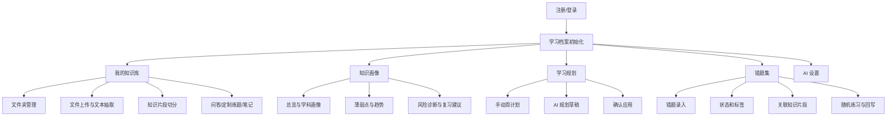

# 智能考研系统软件需求说明书

## 1. 引言

### 1.1 编写目的

本文档定义智能考研系统当前版本的软件需求，包括功能需求、非功能需求、运行环境、用户界面、数据逻辑和验收标准。文档依据现有代码实现重写，作为开发、测试、答辩和维护依据。

### 1.2 项目范围

系统面向个人考研学习者，提供账号登录、学习档案初始化、资料知识库、知识问答、知识画像、学习计划、错题复盘和 AI 参数配置。系统不包含管理员后台、支付、课程售卖、多人协作、正式考试阅卷和机构管理。

### 1.3 用户角色

当前只有一种业务角色：普通学习用户。

普通学习用户可注册登录，管理自己的学科、文件夹、资料、知识问答、错题、学习计划和 AI 设置。系统通过 JWT 和服务层归属校验隔离不同用户的数据。

## 2. 总体描述

### 2.1 产品功能概述

### 2.2 运行环境

| 项 | 要求 |
| --- | --- |
| 操作系统 | Windows、macOS、Linux 均可 |
| JDK | Java 21 |
| 后端 | Maven + Spring Boot 3 |
| 前端 | Node.js/npm + Vue 3 + Vite |
| 数据库 | MySQL 8.x，默认库名 `smart_exam` |
| 浏览器 | Chrome、Edge 等现代浏览器 |
| 可选服务 | Tesseract OCR、Elasticsearch、OpenAI 兼容聊天和 Embedding 接口 |

### 2.3 系统约束

- 用户必须登录后访问业务接口。
- 新用户首次登录需完成考研日期和学科初始化。
- 文件上传必须选择属于当前用户的文件夹。
- 文件夹最大深度为 3 级。
- 知识库问答必须在开启知识库时选择文件夹。
- 图片 OCR 依赖本机 Tesseract。
- AI 直接聊天、AI 规划、AI 诊断增强依赖有效模型配置。
- Elasticsearch 和 Embedding 不可用时，系统应降级为数据库检索。

## 3. 功能需求

### 3.1 用户认证与学习档案

| 编号 | 需求 |
| --- | --- |
| FR-AUTH-01 | 用户可以使用用户名、密码和可选昵称注册账号 |
| FR-AUTH-02 | 用户可以使用用户名和密码登录 |
| FR-AUTH-03 | 登录成功后后端签发 JWT，前端保存 token 和用户信息 |
| FR-AUTH-04 | 除注册登录外，业务 API 必须校验 `Authorization: Bearer <token>` |
| FR-AUTH-05 | 用户可以退出登录，前端清理本地会话 |
| FR-PROFILE-01 | 新用户首次进入系统时必须填写考研日期和 1 至 12 个学科名称 |
| FR-PROFILE-02 | 系统根据学科名称创建一级学科文件夹，并记录 `subjectFolder` 和 `subjectOrder` |
| FR-PROFILE-03 | 用户可以在个人设置中维护考研日期和学科名称 |
| FR-PROFILE-04 | 旧账号在缺少学习档案时应兼容已有一级文件夹并完成初始化 |

### 3.2 资料文件夹管理

| 编号 | 需求 |
| --- | --- |
| FR-FOLDER-01 | 用户可以查看自己的全部资料文件夹 |
| FR-FOLDER-02 | 用户可以在根目录或已有文件夹下创建子文件夹 |
| FR-FOLDER-03 | 文件夹保存名称、描述、父文件夹、深度、是否学科文件夹、排序和创建时间 |
| FR-FOLDER-04 | 系统限制文件夹最大深度为 3 级 |
| FR-FOLDER-05 | 用户可以修改文件夹名称和描述 |
| FR-FOLDER-06 | 用户可以删除自己的文件夹；若存在子文件夹或文件，按服务层校验结果提示 |

### 3.3 资料文件与文本抽取

| 编号 | 需求 |
| --- | --- |
| FR-FILE-01 | 用户可以向当前文件夹上传文件 |
| FR-FILE-02 | 上传时可选择标签：教材、资料、笔记、习题、其他 |
| FR-FILE-03 | 系统保存原文件名、存储路径、内容类型、上传时间和抽取文本 |
| FR-FILE-04 | 系统支持抽取 PDF、DOC、DOCX、图片、TXT、Markdown 内容 |
| FR-FILE-05 | 图片 OCR 使用本机 Tesseract 命令 |
| FR-FILE-06 | 抽取失败或不支持时应返回可理解提示，用户可手动补充文本 |
| FR-FILE-07 | 用户可以编辑抽取文本并保存，保存后重建知识片段 |
| FR-FILE-08 | 用户可以修改资料显示名称，系统保留原扩展名 |
| FR-FILE-09 | 用户可以将文件加入或移出知识库 |
| FR-FILE-10 | 用户可以移动文件到其他属于自己的文件夹 |
| FR-FILE-11 | 用户可以删除文件，系统同步删除本地文件和相关知识片段 |

### 3.4 知识库构建

| 编号 | 需求 |
| --- | --- |
| FR-KB-01 | 知识库启用的文件保存后自动切分为知识片段 |
| FR-KB-02 | 每个片段记录文件、文件夹、片段序号、页码、切片版本和内容 |
| FR-KB-03 | 当前切片版本为 2，目标长度约 800 字符，最大约 1100 字符，最小有效片段约 300 字符 |
| FR-KB-04 | 切片应尽量按标题、段落、句子、自然停顿保持语义完整 |
| FR-KB-05 | 页码可按文本偏移估算，用于来源定位 |
| FR-KB-06 | 移出知识库时删除对应知识片段 |
| FR-KB-07 | 系统可异步将知识片段写入 Elasticsearch 索引 |
| FR-KB-08 | 知识片段应记录引用次数、正确反馈次数、错误反馈次数、最近访问时间和最近练习时间 |

### 3.5 知识问答与定制练题

| 编号 | 需求 |
| --- | --- |
| FR-CHAT-01 | 用户可以选择一个文件夹作为知识问答范围 |
| FR-CHAT-02 | 使用知识库时，检索范围包含当前文件夹及所有子文件夹 |
| FR-CHAT-03 | 用户可以选择答疑助手或定制练题 |
| FR-CHAT-04 | 用户可以开启或关闭知识库，关闭后进入直接聊天 |
| FR-CHAT-05 | 用户可以开启或关闭来源引用 |
| FR-CHAT-06 | 用户可以开启深度回答，系统执行查询改写和补充检索 |
| FR-CHAT-07 | 前端优先使用 `/api/chat/stream` 获取 SSE 流式回答 |
| FR-CHAT-08 | 流式请求失败时前端可回退普通 `/api/chat` |
| FR-CHAT-09 | 答案来源应包含引用编号、chunkId、fileId、folderId、文件名、页码、摘录和学习统计 |
| FR-CHAT-10 | 用户可以点击来源查看片段，并对片段提交“很清楚”或“忘记了”反馈 |
| FR-CHAT-11 | 系统应将返回给前端的来源片段计入引用统计 |
| FR-CHAT-12 | 用户可以将当前问答会话整理为笔记并保存到当前文件夹 |
| FR-CHAT-13 | 定制练题可以根据文件夹、可选学科、提问要求和排除片段生成一个练习题 |
| FR-CHAT-14 | 定制练题返回问题、参考答案、来源片段和 chunkId，并支持加入错题集 |

### 3.6 知识画像

| 编号 | 需求 |
| --- | --- |
| FR-KP-01 | 系统提供知识画像总览，展示片段总数、覆盖率、掌握度、薄弱点、高风险点和考研倒计时 |
| FR-KP-02 | 系统按一级学科文件夹聚合学科画像 |
| FR-KP-03 | 系统按资料文件聚合文件画像，并支持按学科过滤 |
| FR-KP-04 | 系统提供薄弱知识点列表，显示摘录、掌握度、反馈次数和复习优先级 |
| FR-KP-05 | 系统提供学习趋势、掌握度分布和活动统计 |
| FR-KP-06 | 系统提供风险分析，包括高风险 chunk、复习压力趋势和风险气泡数据 |
| FR-KP-07 | 系统提供诊断建议；数据不足时返回规则化提示，AI 可用时增加 AI 总结 |
| FR-KP-08 | 系统支持按关键词、学科文件夹和资料文件搜索 chunk，供错题关联使用 |

### 3.7 AI 设置

| 编号 | 需求 |
| --- | --- |
| FR-AI-01 | 用户可以配置 AI 角色定位 |
| FR-AI-02 | 用户可以配置系统提示词 |
| FR-AI-03 | 用户可以配置聊天模型名称、Endpoint、API Key |
| FR-AI-04 | 用户可以配置 Embedding 模型名称、Endpoint、API Key、维度 |
| FR-AI-05 | 系统支持读取、保存和套用用户级 AI 设置预设 |
| FR-AI-06 | 未配置用户级设置时，系统可读取后端默认配置或使用空配置降级 |

### 3.8 学习计划

| 编号 | 需求 |
| --- | --- |
| FR-PLAN-01 | 用户可以按周查看学习计划 |
| FR-PLAN-02 | 用户可以新增、修改和删除计划项 |
| FR-PLAN-03 | 计划项包含标题、科目、说明、类型、日期、开始时间、结束时间、地点、优先级、状态和来源 |
| FR-PLAN-04 | 系统校验标题非空，结束时间晚于开始时间 |
| FR-PLAN-05 | 计划类型包括课程、自习、复盘、考试、任务、休息 |
| FR-PLAN-06 | 计划状态包括待办、完成、跳过 |
| FR-PLAN-07 | 用户可以在前端撤回最近的计划草稿修改 |
| FR-PLAN-08 | 用户可以与 AI 多轮讨论学习计划 |
| FR-PLAN-09 | AI 可以生成 CREATE、UPDATE、DELETE 操作草稿和预览结果 |
| FR-PLAN-10 | AI 草稿必须由用户确认后才写入真实日程 |
| FR-PLAN-11 | 系统可以基于知识画像诊断生成计划建议 |

### 3.9 错题集

| 编号 | 需求 |
| --- | --- |
| FR-MISTAKE-01 | 用户可以查看自己的错题列表 |
| FR-MISTAKE-02 | 用户可以按掌握状态和科目标签筛选错题 |
| FR-MISTAKE-03 | 用户可以录入题干文本、题目文件、题目图片、解析文本、解析文件和解析图片 |
| FR-MISTAKE-04 | 用户可以对错题文件执行文本识别，识别逻辑复用文本抽取服务 |
| FR-MISTAKE-05 | 用户可以设置错题为完全掌握或未完全掌握 |
| FR-MISTAKE-06 | 用户可以创建、修改、删除自定义掌握状态 |
| FR-MISTAKE-07 | 系统提供默认“未掌握”和“完全掌握”语义 |
| FR-MISTAKE-08 | 用户可以创建和删除科目标签 |
| FR-MISTAKE-09 | 系统可将一级学科文件夹同步为同名科目标签 |
| FR-MISTAKE-10 | 错题可以绑定多个科目标签 |
| FR-MISTAKE-11 | 错题可以关联多个知识片段 |
| FR-MISTAKE-12 | 定制练题生成的问题可以直接保存为错题，并保留 chunk 关联 |
| FR-MISTAKE-13 | 用户可以按数量和标签随机抽取未掌握错题练习 |
| FR-MISTAKE-14 | 练习结果记录“写对了/写错了”，并回写到关联知识片段 |
| FR-MISTAKE-15 | 用户可以删除错题，系统同步删除相关附件文件 |

## 4. 非功能需求

### 4.1 性能需求

| 编号 | 需求 |
| --- | --- |
| NFR-PERF-01 | 普通列表查询应满足本地演示环境的即时响应 |
| NFR-PERF-02 | 单个上传文件默认不超过 200MB，请求总大小不超过 220MB |
| NFR-PERF-03 | 知识问答最终进入 prompt 的片段最多 5 个 |
| NFR-PERF-04 | 检索候选片段最多 20 个后进入 rerank |
| NFR-PERF-05 | ES 和 Embedding 调用应设置超时，不可用时降级 |
| NFR-PERF-06 | AI 规划和问答应避免无限等待，超时后返回提示或兜底结果 |

### 4.2 安全需求

| 编号 | 需求 |
| --- | --- |
| NFR-SEC-01 | 用户密码必须哈希保存，不得明文保存 |
| NFR-SEC-02 | 业务接口必须校验 JWT |
| NFR-SEC-03 | 文件夹、文件、错题、标签、计划、知识片段访问必须校验当前用户归属 |
| NFR-SEC-04 | 生产环境必须替换默认 JWT Secret |
| NFR-SEC-05 | 生产环境应加密保存 API Key，并避免把真实密钥写入仓库 |
| NFR-SEC-06 | 上传目录应限制在应用配置路径下，避免任意路径写入 |

### 4.3 可用性需求

| 编号 | 需求 |
| --- | --- |
| NFR-USE-01 | 前端应提供首页、知识库、知识画像、学习规划、错题集、个人设置和 AI 设置入口 |
| NFR-USE-02 | 上传资料后必须允许用户校正文档抽取文本 |
| NFR-USE-03 | 问答来源应可点击查看，并展示基础学习统计 |
| NFR-USE-04 | 外部 AI、Embedding、ES、OCR 不可用时，应提供明确提示或降级 |
| NFR-USE-05 | AI 规划必须先预览再应用，避免误改真实计划 |

### 4.4 可维护性需求

| 编号 | 需求 |
| --- | --- |
| NFR-MAIN-01 | 后端按 Controller、Service、Repository、Model、DTO 分层 |
| NFR-MAIN-02 | 前端 API 请求集中封装在 `frontend/src/api/client.js` |
| NFR-MAIN-03 | 运行配置集中在 `application.yml`、profile 配置和前端环境变量 |
| NFR-MAIN-04 | ES 索引应可由数据库知识片段重建，不作为唯一主数据 |

## 5. 用户界面需求

| 页面 | 需求 |
| --- | --- |
| 登录/注册 | 支持登录和注册切换，展示错误提示 |
| 初始化页 | 录入考研日期和学科名称 |
| 首页 | 展示考研倒计时和今日计划 |
| 我的知识库 | 提供我的资料、知识问答、上传编辑三个入口 |
| 我的资料 | 展示文件夹树、当前文件夹、文件列表，支持创建、修改、删除、移动 |
| 上传编辑 | 支持选择标签、上传文件、编辑抽取文本、分页查看文本 |
| 知识问答 | 支持答疑助手/定制练题、知识库开关、引用开关、深度回答、来源查看 |
| 知识画像 | 展示总览卡片、图表、薄弱点、风险和诊断建议 |
| 学习规划 | 提供自我规划和 AI 规划，手动计划使用周课表展示 |
| 错题集 | 提供上传错题、随机练习、浏览错题 |
| 个人设置 | 维护考研日期和一级学科 |
| AI 设置 | 维护模型配置、提示词和预设 |

## 6. 数据逻辑

### 6.1 数据来源

| 数据 | 来源 |
| --- | --- |
| 用户账号 | 注册表单 |
| 学习档案 | 初始化页和个人设置 |
| 资料文件 | 用户上传 |
| 抽取文本 | 文档解析、OCR 或手动编辑 |
| 知识片段 | 系统根据抽取文本自动切分 |
| 问答内容 | 用户输入、模型输出和来源片段 |
| 学习画像 | chunk 引用、反馈、错题练习和访问事件 |
| 学习计划 | 用户手动创建、画像建议或 AI 草稿确认 |
| 错题数据 | 用户录入、文件识别、定制题加入 |
| AI 设置 | 用户填写或后端默认配置 |

### 6.2 数据保存

- 结构化数据保存到 MySQL。
- 上传资料、题目文件、解析文件和图片附件保存到本地 `uploads` 目录。
- 知识片段和学习事件以 MySQL 为主数据。
- Elasticsearch 索引是可重建的检索缓存。
- 前端可在 `localStorage` 保存 token、用户信息、部分 UI 状态、聊天历史和 AI 设置快照。

### 6.3 数据校验

- 用户名、密码、文件夹名称、计划标题、学科名称等必填字段需校验。
- 学科数量限制为 1 至 12。
- 文件夹深度不能超过 3。
- 计划结束时间必须晚于开始时间。
- 自定义状态、科目标签在当前用户范围内不能重复。
- 删除被使用的状态或标签时应阻止删除。
- 所有资源访问必须按当前用户校验归属。

## 7. 验收标准

系统满足以下条件即可认为达到当前版本需求：

1. 用户可完成注册、登录、退出和首次学习档案初始化。
2. 用户可创建文件夹、上传资料、抽取并编辑文本、加入知识库。
3. 系统可把资料切分为知识片段，并在问答中返回带来源的答案。
4. 用户可进行定制练题、来源反馈和会话生成笔记。
5. 用户可查看知识画像，并看到反馈和练习数据对画像指标的影响。
6. 用户可创建、修改、删除学习计划，并可预览和应用 AI 规划草稿。
7. 用户可录入错题、管理状态和标签、关联知识片段、随机练习并回写结果。
8. 用户可配置 AI 设置和预设；无外部服务时基础资料、计划和错题功能仍可运行。
9. 不同用户之间不能访问彼此的文件夹、资料、错题、计划和知识片段。
