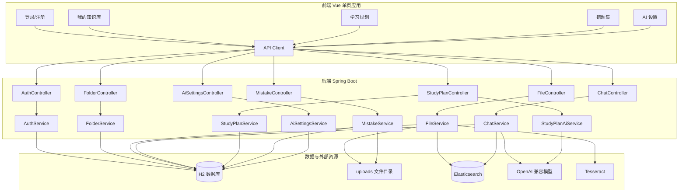
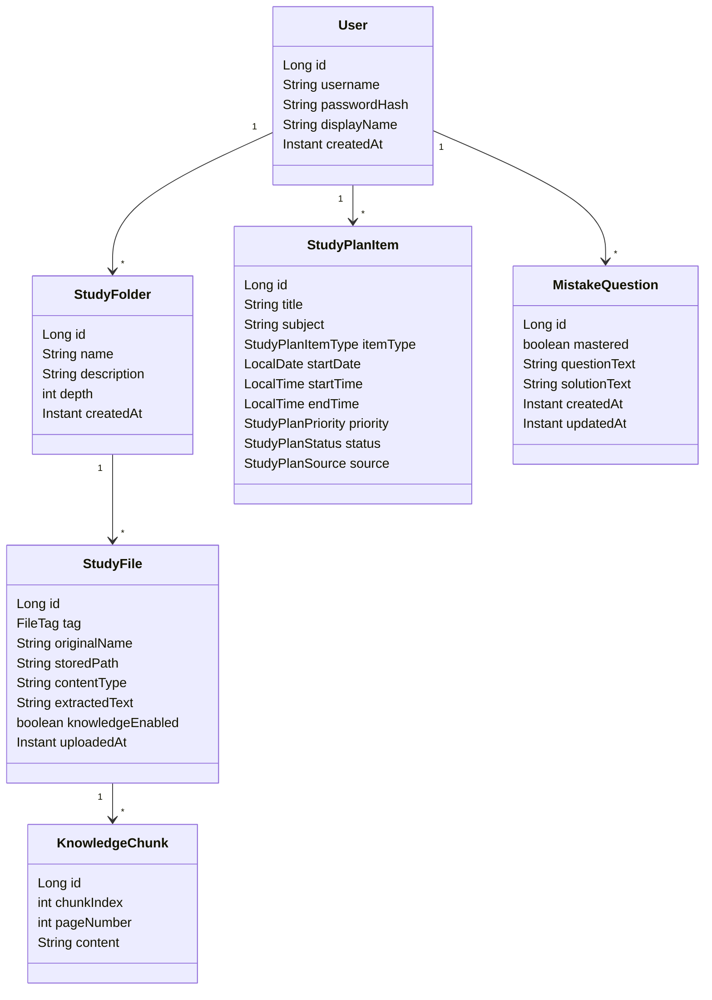
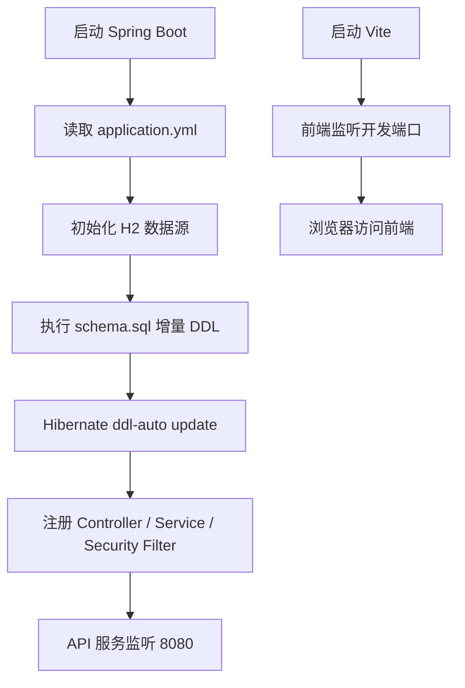
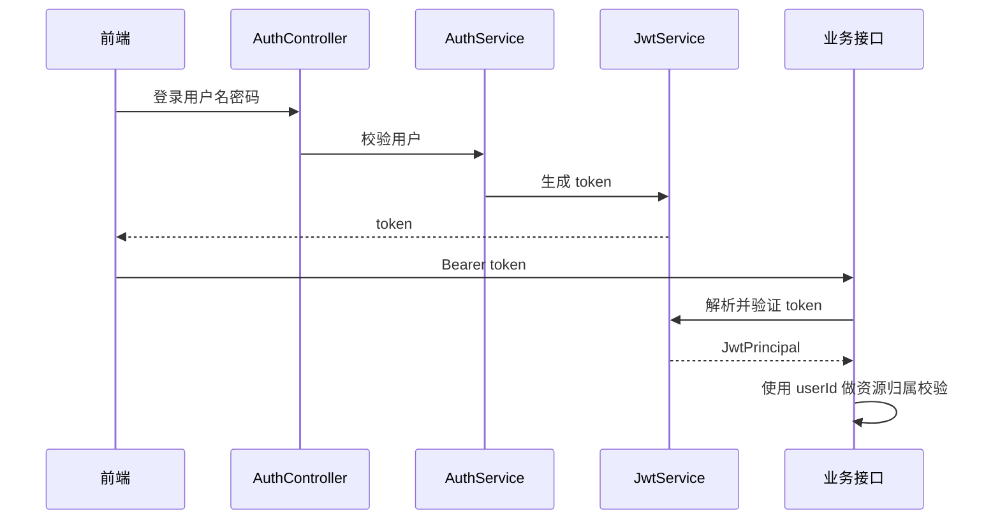
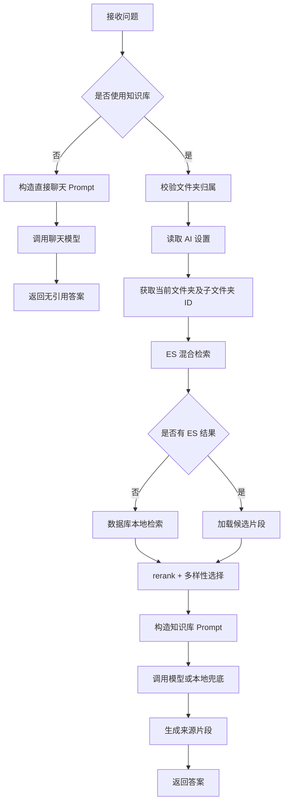

# 智能考研系统概要设计说明书

## 1. 设计目标

本系统采用前后端分离和后端分层设计，目标是在单机环境下完成个人考研资料管理、知识库问答、错题复盘和学习计划管理。概要设计关注模块划分、功能分配、接口关系、运行流程、数据结构和异常处理，为详细设计提供基础。

## 2. 总体结构设计

## 3. 模块划分与功能分配

| 模块 | 前端位置 | 后端类 | 主要职责 |
| --- | --- | --- | --- |
| 认证模块 | `App.vue` 登录区、`client.js` | `AuthController`、`AuthService`、`JwtService` | 注册、登录、签发 JWT、解析 JWT |
| 文件夹模块 | 我的资料、侧边栏文件夹树 | `FolderController`、`FolderService` | 文件夹增删改查、父子层级、归属校验 |
| 文件/知识库模块 | 上传编辑、资料列表 | `FileController`、`FileService`、`TextExtractionService` | 上传、抽取文本、编辑、移动、删除、切片入库 |
| 问答模块 | 知识问答页面 | `ChatController`、`ChatService`、`ElasticsearchService`、`EmbeddingService` | RAG 检索、prompt 构造、模型调用、SSE 输出、来源引用 |
| AI 设置模块 | AI 设置页面 | `AiSettingsController`、`AiSettingsService` | 保存用户模型配置 |
| 学习计划模块 | 学习规划页面 | `StudyPlanController`、`StudyPlanService`、`StudyPlanAiService` | 手动计划 CRUD、AI 计划生成和应用 |
| 错题模块 | 错题集页面 | `MistakeController`、`MistakeService` | 错题、附件、状态、标签、随机练习 |
| 异常处理 | 全局提示 | `ApiExceptionHandler` | 参数异常、业务异常、接口错误响应 |

## 4. 逻辑视图

## 5. 接口设计

### 5.1 接口风格

系统使用 REST API：

- 普通请求使用 JSON。
- 文件上传使用 `multipart/form-data`。
- 流式问答使用 `text/event-stream`。
- 除注册登录外，请求头携带 `Authorization: Bearer <token>`。

### 5.2 主要接口

| 方法 | 路径 | 说明 |
| --- | --- | --- |
| POST | `/api/auth/register` | 用户注册 |
| POST | `/api/auth/login` | 用户登录 |
| GET | `/api/folders` | 查询文件夹 |
| POST | `/api/folders` | 创建文件夹 |
| PATCH | `/api/folders/{folderId}` | 修改文件夹 |
| DELETE | `/api/folders/{folderId}` | 删除文件夹 |
| GET | `/api/folders/{folderId}/files` | 查询文件夹文件 |
| POST | `/api/folders/{folderId}/files` | 上传文件 |
| GET | `/api/files/{fileId}` | 查看文件 |
| PUT | `/api/files/{fileId}` | 更新文件文本和标签 |
| PATCH | `/api/files/{fileId}/knowledge` | 修改知识库状态 |
| PATCH | `/api/files/{fileId}/move` | 移动文件 |
| DELETE | `/api/files/{fileId}` | 删除文件 |
| POST | `/api/chat` | 普通问答 |
| POST | `/api/chat/stream` | 流式问答 |
| POST | `/api/chat/note` | 会话生成笔记 |
| GET/PUT | `/api/ai-settings` | 读取/保存 AI 设置 |
| GET/POST | `/api/study-plan` | 查询/创建学习计划 |
| PUT/DELETE | `/api/study-plan/{itemId}` | 修改/删除学习计划 |
| POST | `/api/study-plan/ai/chat` | AI 规划对话 |
| POST | `/api/study-plan/ai/generate` | 生成 AI 规划草稿 |
| POST | `/api/study-plan/ai/apply` | 应用 AI 规划操作 |
| GET/POST | `/api/mistakes` | 查询/创建错题 |
| PUT/DELETE | `/api/mistakes/{mistakeId}` | 修改/删除错题 |
| GET | `/api/mistakes/practice` | 随机练习 |
| POST | `/api/mistakes/recognize` | 错题文件识别文本 |

## 6. 运行设计

### 6.1 启动流程

### 6.2 鉴权流程

### 6.3 问答运行流程

以下流程图表达 UML 活动图含义：

## 7. 数据结构设计

### 7.1 主要实体

| 实体 | 说明 |
| --- | --- |
| `User` | 用户账号 |
| `UserAiSettings` | 用户 AI 配置 |
| `StudyFolder` | 资料文件夹 |
| `StudyFile` | 上传资料文件 |
| `KnowledgeChunk` | 知识库片段 |
| `StudyPlanItem` | 学习计划项 |
| `MistakeQuestion` | 错题主表 |
| `MistakeAttachment` | 错题题目/解析图片附件 |
| `MistakeStatus` | 自定义掌握状态 |
| `MistakeSubjectTag` | 科目标签 |

### 7.2 枚举设计

| 枚举 | 值 |
| --- | --- |
| `FileTag` | `TEXTBOOK`、`MATERIAL`、`NOTE`、`EXERCISE`、`OTHER` |
| `QuestionMode` | `QA`、`TEACHER` |
| `StudyPlanItemType` | `COURSE`、`SELF_STUDY`、`REVIEW`、`EXAM`、`TASK`、`REST` |
| `StudyPlanPriority` | `LOW`、`MEDIUM`、`HIGH` |
| `StudyPlanStatus` | `TODO`、`DONE`、`SKIPPED` |
| `StudyPlanSource` | `MANUAL`、`AI` |
| `MistakeAttachmentType` | `QUESTION`、`SOLUTION` |

## 8. 出错处理设计

| 场景 | 处理方式 |
| --- | --- |
| 参数校验失败 | Controller 层 validation 抛出异常，由 `ApiExceptionHandler` 返回错误 |
| 未登录或 token 无效 | Spring Security 拦截 |
| 访问他人资源 | Service 层按 userId 查询，不存在则抛出业务异常 |
| 文件抽取失败 | 返回抽取失败提示，用户可手动补充文本 |
| Elasticsearch 不可用 | 标记短暂不可用，回退数据库本地检索 |
| 未配置模型 API Key | 知识库问答使用本地摘要兜底；直接聊天提示配置模型 |
| 模型接口异常 | 捕获异常并返回兜底答案或错误信息 |
| 删除正在被使用的错题状态/标签 | 阻止删除并提示 |

## 9. 概要设计结论

系统按照前端单页应用、后端分层服务、H2 持久化、本地文件存储和可选 AI/ES 增强进行设计。模块之间边界清晰，知识库问答、错题和学习计划相对独立，适合毕业设计开发和演示。
