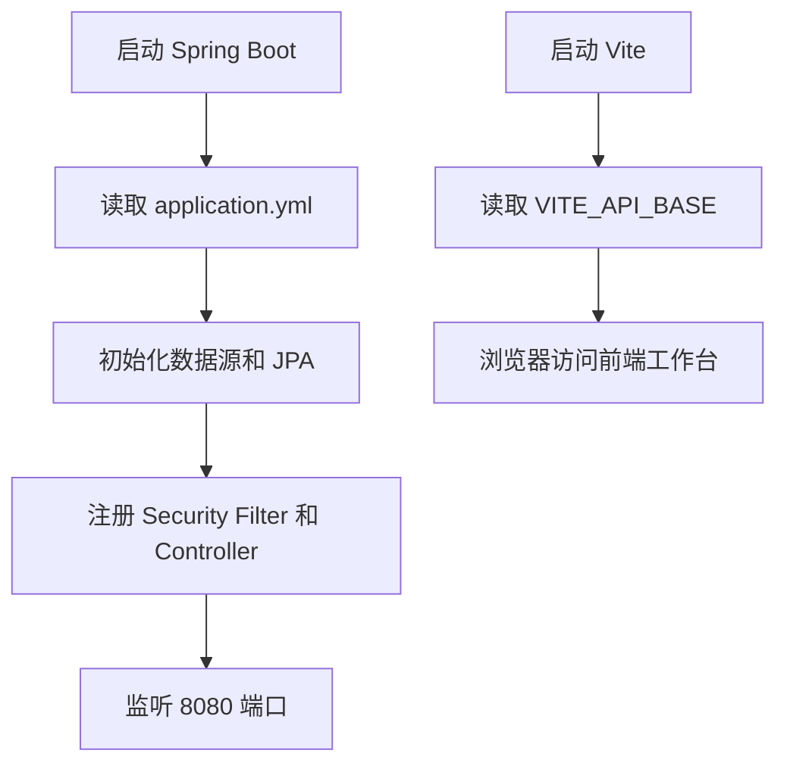
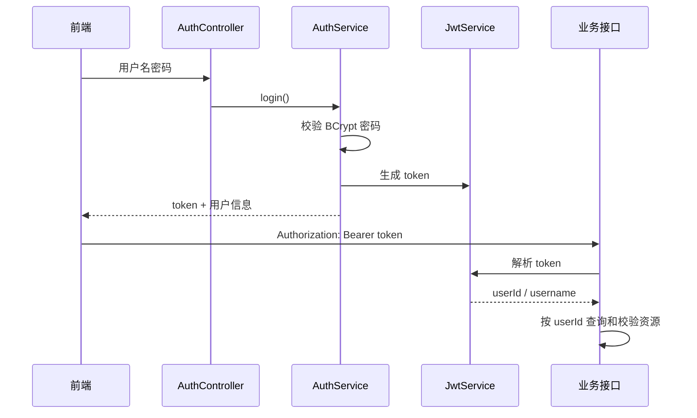
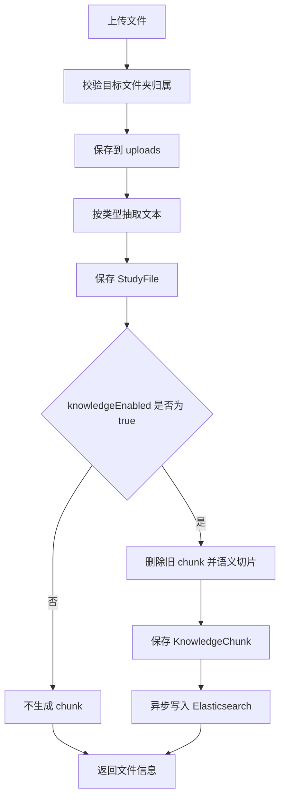
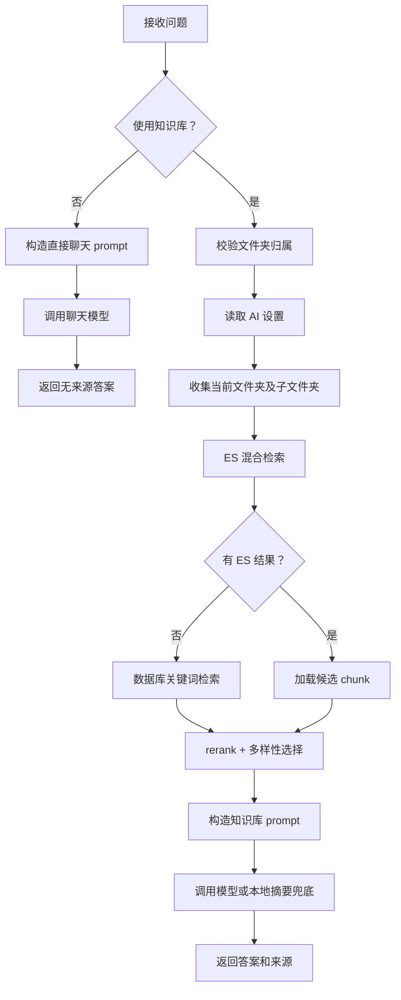
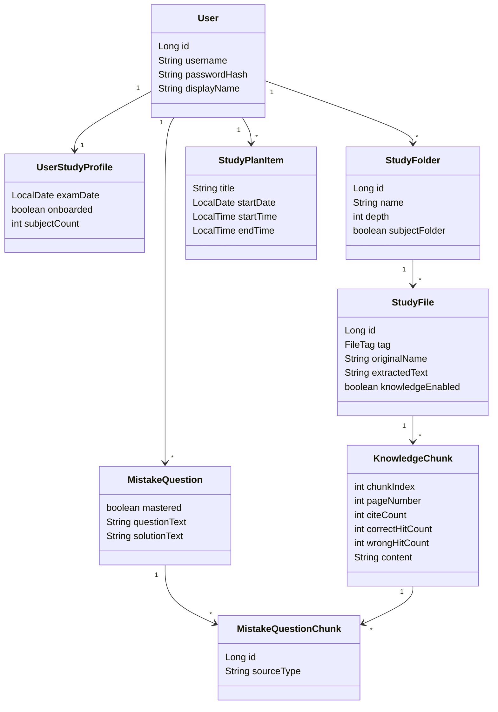

# 智能考研系统概要设计说明书

## 1. 设计目标

智能考研系统采用前后端分离和后端分层架构，目标是在单机环境下完成个人考研资料管理、知识库问答、学习画像、错题复盘和学习计划管理。概要设计关注模块划分、接口关系、核心流程、数据结构和异常处理，为详细设计和实现维护提供依据。

## 2. 总体结构设计

```mermaid
flowchart TB
    subgraph Frontend["前端 Vue 单页应用"]
        AuthView["登录/注册"]
        Onboarding["学习档案初始化"]
        Home["首页"]
        Knowledge["我的知识库"]
        Profile["知识画像"]
        Planner["学习规划"]
        Mistakes["错题集"]
        Settings["个人设置 / AI 设置"]
        ApiClient["API Client"]
    end

    subgraph Backend["后端 Spring Boot"]
        AuthC["AuthController"]
        StudyProfileC["StudyProfileController"]
        FolderC["FolderController"]
        FileC["FileController"]
        ChatC["ChatController"]
        KnowledgeProfileC["KnowledgeProfileController"]
        PlanC["StudyPlanController"]
        MistakeC["MistakeController"]
        AiC["AiSettingsController"]

        AuthS["AuthService"]
        StudyProfileS["StudyProfileService"]
        FolderS["FolderService"]
        FileS["FileService"]
        ChatS["ChatService"]
        KnowledgeProfileS["KnowledgeProfileService"]
        PlanS["StudyPlanService"]
        PlanAiS["StudyPlanAiService"]
        MistakeS["MistakeService"]
        AiS["AiSettingsService"]
    end

    subgraph Resource["数据与外部资源"]
        DB[("MySQL")]
        Uploads["uploads 目录"]
        OCR["Tesseract"]
        ES[("Elasticsearch")]
        LLM["OpenAI 兼容模型"]
    end

    AuthView --> ApiClient
    Onboarding --> ApiClient
    Home --> ApiClient
    Knowledge --> ApiClient
    Profile --> ApiClient
    Planner --> ApiClient
    Mistakes --> ApiClient
    Settings --> ApiClient

    ApiClient --> AuthC
    ApiClient --> StudyProfileC
    ApiClient --> FolderC
    ApiClient --> FileC
    ApiClient --> ChatC
    ApiClient --> KnowledgeProfileC
    ApiClient --> PlanC
    ApiClient --> MistakeC
    ApiClient --> AiC

    AuthC --> AuthS
    StudyProfileC --> StudyProfileS
    FolderC --> FolderS
    FileC --> FileS
    ChatC --> ChatS
    KnowledgeProfileC --> KnowledgeProfileS
    PlanC --> PlanS
    PlanC --> PlanAiS
    MistakeC --> MistakeS
    AiC --> AiS

    AuthS --> DB
    StudyProfileS --> DB
    FolderS --> DB
    FileS --> DB
    ChatS --> DB
    KnowledgeProfileS --> DB
    PlanS --> DB
    MistakeS --> DB
    AiS --> DB
    FileS --> Uploads
    MistakeS --> Uploads
    FileS --> OCR
    FileS --> ES
    ChatS --> ES
    ChatS --> LLM
    PlanAiS --> LLM
    KnowledgeProfileS --> LLM
```

## 3. 模块划分

| 模块 | 前端位置 | 后端类 | 主要职责 |
| --- | --- | --- | --- |
| 认证模块 | `AuthView`、`client.js` | `AuthController`、`AuthService`、`JwtService` | 注册、登录、密码哈希、JWT 签发和解析 |
| 学习档案模块 | `OnboardingView`、`PersonalSettingsView` | `StudyProfileController`、`StudyProfileService` | 首次初始化、考研日期、学科文件夹维护 |
| 文件夹模块 | `LibraryView`、侧边栏文件夹树 | `FolderController`、`FolderService` | 文件夹增删改查、层级限制、归属校验 |
| 文件/知识库模块 | `EditorView`、`LibraryView` | `FileController`、`FileService`、`TextExtractionService` | 上传、抽取、编辑、移动、删除、切片入库 |
| 问答模块 | `ChatView` | `ChatController`、`ChatService`、`ElasticsearchService`、`EmbeddingService` | RAG 检索、流式回答、来源引用、定制练题、生成笔记 |
| 知识画像模块 | `ProfileView` | `KnowledgeProfileController`、`KnowledgeProfileService` | 总览、学科、文件、薄弱点、趋势、风险、诊断、chunk 搜索 |
| 学习计划模块 | `PlannerView` | `StudyPlanController`、`StudyPlanService`、`StudyPlanAiService` | 手动计划 CRUD、AI 草稿生成和确认应用 |
| 错题模块 | `MistakesView` 及组件 | `MistakeController`、`MistakeService` | 错题录入、附件、状态、标签、关联 chunk、随机练习 |
| AI 设置模块 | `SettingsView` | `AiSettingsController`、`AiSettingsService` | 用户级模型配置和预设 |
| 异常处理 | 全局错误提示 | `ApiExceptionHandler` | 参数异常、业务异常、超时和服务端错误响应 |

## 4. 接口设计

### 4.1 接口风格

- 普通业务请求使用 JSON。
- 上传资料和错题附件使用 `multipart/form-data`。
- 流式问答使用 `text/event-stream`。
- 除 `/api/auth/register` 和 `/api/auth/login` 外，接口必须携带 `Authorization: Bearer <token>`。
- 前端统一通过 `frontend/src/api/client.js` 封装请求、token 和错误处理。

### 4.2 主要接口

| 方法 | 路径 | 说明 |
| --- | --- | --- |
| POST | `/api/auth/register` | 注册 |
| POST | `/api/auth/login` | 登录 |
| GET/PUT | `/api/study-profile` | 读取/更新学习档案 |
| POST | `/api/study-profile/onboarding` | 首次初始化学科和考研日期 |
| GET/POST | `/api/folders` | 查询/创建文件夹 |
| PATCH/DELETE | `/api/folders/{folderId}` | 修改/删除文件夹 |
| GET/POST | `/api/folders/{folderId}/files` | 查询文件夹文件、上传文件 |
| GET/PUT/DELETE | `/api/files/{fileId}` | 查看、更新、删除文件 |
| PATCH | `/api/files/{fileId}/knowledge` | 加入或移出知识库 |
| PATCH | `/api/files/{fileId}/move` | 移动文件 |
| POST | `/api/chat` | 普通问答 |
| POST | `/api/chat/stream` | 流式问答 |
| POST | `/api/chat/teacher/question` | 定制练题生成问题 |
| POST | `/api/chat/chunks/{chunkId}/feedback` | 来源片段反馈 |
| POST | `/api/chat/note` | 会话生成笔记 |
| GET | `/api/knowledge-profile/*` | 知识画像各类统计、诊断和 chunk 搜索 |
| GET/PUT | `/api/ai-settings` | 读取/保存 AI 设置 |
| GET/PUT | `/api/ai-settings/presets` | 读取/保存 AI 预设 |
| GET/POST | `/api/study-plan` | 查询/创建学习计划 |
| PUT/DELETE | `/api/study-plan/{itemId}` | 修改/删除计划 |
| POST | `/api/study-plan/profile-suggestion` | 画像建议加入计划 |
| POST | `/api/study-plan/ai/chat` | AI 规划对话 |
| POST | `/api/study-plan/ai/generate` | 生成 AI 规划草稿 |
| POST | `/api/study-plan/ai/apply` | 应用 AI 草稿 |
| GET/POST | `/api/mistakes` | 查询/创建错题 |
| PUT/DELETE | `/api/mistakes/{mistakeId}` | 修改/删除错题 |
| GET | `/api/mistakes/practice` | 随机练习 |
| POST | `/api/mistakes/recognize` | 错题文件识别 |
| POST | `/api/mistakes/from-teacher-question` | 定制题加入错题 |
| POST | `/api/mistakes/{mistakeId}/practice-result` | 记录练习结果 |

## 5. 运行流程设计

### 5.1 启动流程

### 5.2 登录鉴权流程

### 5.3 资料入库流程

### 5.4 问答流程

## 6. 数据结构设计

### 6.1 逻辑类图

### 6.2 主要枚举

| 枚举 | 值 |
| --- | --- |
| `FileTag` | `TEXTBOOK`、`MATERIAL`、`NOTE`、`EXERCISE`、`OTHER` |
| `QuestionMode` | `QA`、`TEACHER` |
| `KnowledgeChunkEventType` | `CITED`、`PRACTICE_CORRECT`、`PRACTICE_WRONG` |
| `StudyPlanItemType` | `COURSE`、`SELF_STUDY`、`REVIEW`、`EXAM`、`TASK`、`REST` |
| `StudyPlanPriority` | `LOW`、`MEDIUM`、`HIGH` |
| `StudyPlanStatus` | `TODO`、`DONE`、`SKIPPED` |
| `StudyPlanSource` | `MANUAL`、`AI` |
| `MistakeAttachmentType` | `QUESTION`、`SOLUTION` |
| `MistakeQuestionChunkSourceType` | `MANUAL`、`TEACHER` |

## 7. 异常处理设计

| 场景 | 处理方式 |
| --- | --- |
| 参数校验失败 | `ApiExceptionHandler` 返回 400 和错误消息 |
| 未登录或 token 无效 | Spring Security 拦截 |
| 访问他人资源 | Service 层按 userId 查询，不存在则视为无权访问 |
| 文件抽取失败 | 返回提示，允许手动补充文本 |
| OCR 未安装 | 返回 OCR 失败信息，资料仍可人工编辑 |
| Elasticsearch 不可用 | 短期标记不可用，回退数据库检索 |
| 未配置聊天模型 | 知识库问答使用本地摘要，直接聊天提示配置模型 |
| 模型接口异常 | 捕获异常并返回兜底答案或错误 |
| 计划时间非法 | 返回参数错误 |
| 删除被使用的状态/标签 | 阻止删除并提示 |
| 学习画像数据不足 | 返回规则化提示，不阻塞页面 |

## 8. 概要设计结论

系统以 Service 层为业务核心，Controller 保持轻量，Repository 负责持久化，前端通过统一 composable 和 API client 管理状态与请求。整体设计满足毕业设计中对资料管理、智能问答、学习画像、错题复盘和计划管理的功能展示要求，并为后续生产化部署留下扩展空间。
