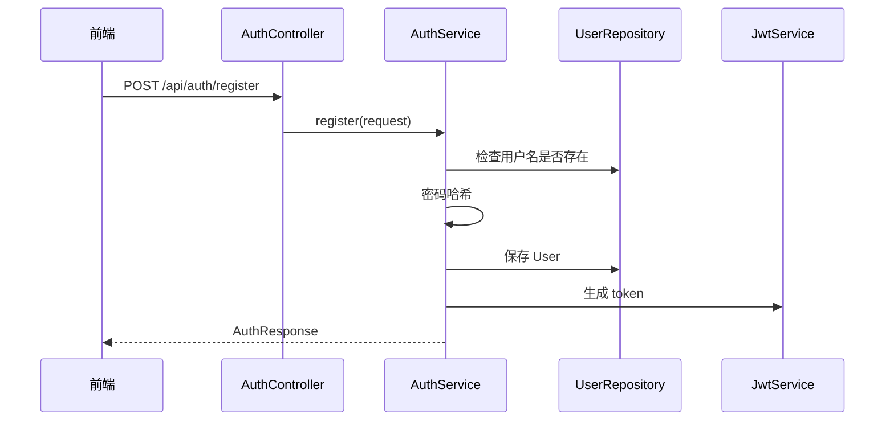
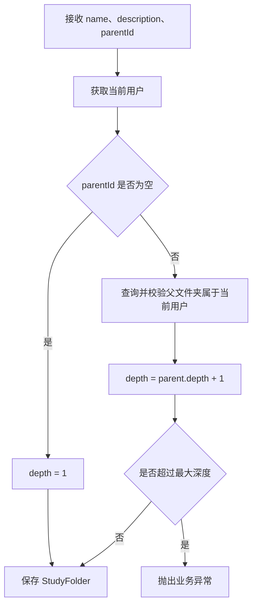
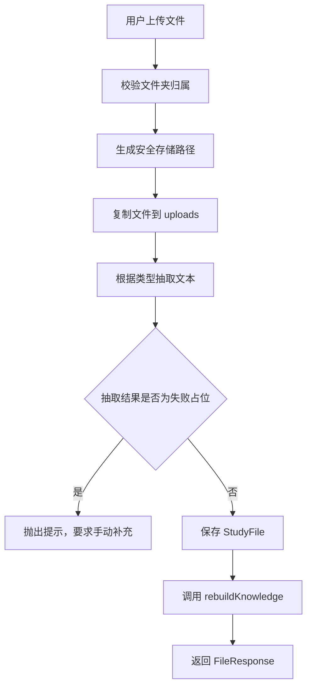
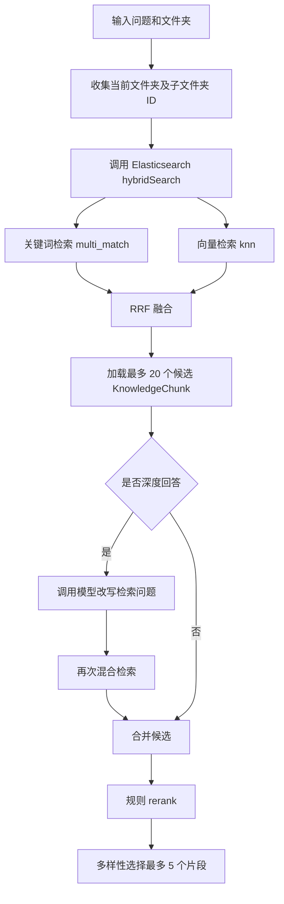
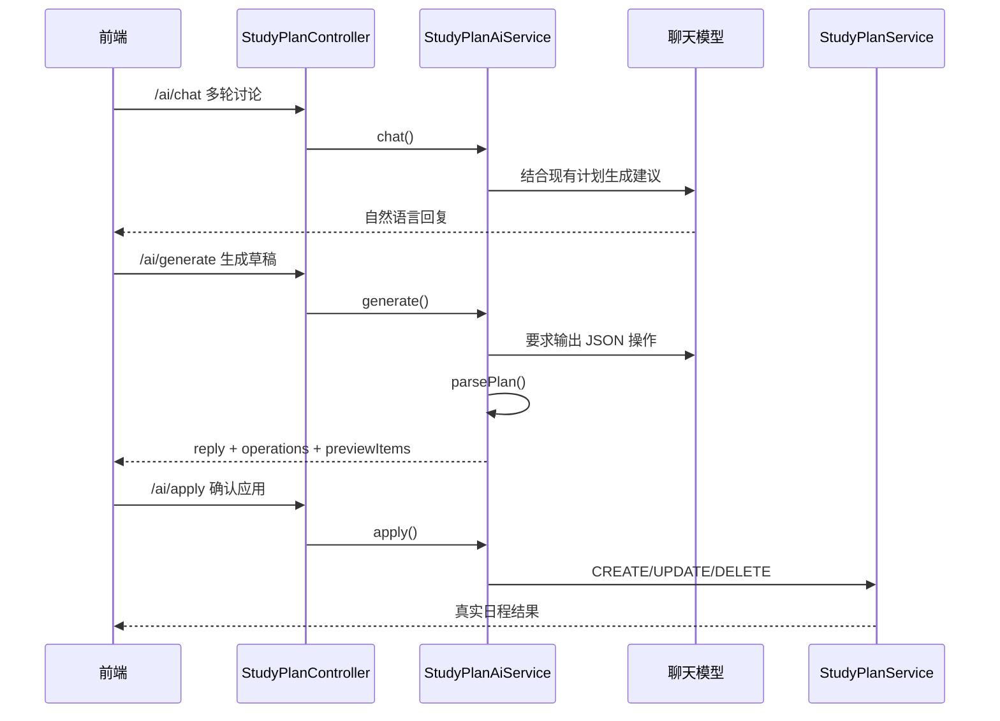
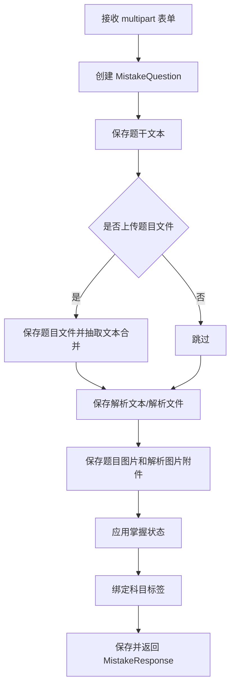

# 智能考研系统详细设计说明书

## 1. 文档说明

本文档描述智能考研系统各模块的详细实现，包括主要类、处理流程、算法逻辑、输入输出和异常策略。内容依据当前代码实现编写。

## 2. 认证模块详细设计

### 2.1 相关类

| 类 | 职责 |
| --- | --- |
| `AuthController` | 暴露注册、登录接口 |
| `AuthService` | 用户创建、密码校验、登录响应生成 |
| `JwtService` | 生成和解析 JWT |
| `JwtAuthenticationFilter` | 从请求头解析 token 并写入认证上下文 |
| `SecurityConfig` | 配置安全规则 |
| `CurrentUserService` | 获取当前登录用户 |

### 2.2 注册流程



### 2.3 登录流程

用户输入用户名和密码。后端查询用户，校验密码哈希，成功后签发 JWT。前端将 token 保存到 `localStorage`，后续请求自动加入 `Authorization` 请求头。

## 3. 文件夹模块详细设计

### 3.1 数据结构

`StudyFolder` 包含 `owner`、`parent`、`name`、`description`、`depth`、`createdAt`。父文件夹为空表示根目录下一级文件夹。

### 3.2 创建文件夹流程



### 3.3 输入输出

输入：文件夹名称、描述、父文件夹 ID。  
输出：`FolderResponse(id, name, description, parentId, depth, createdAt)`。

## 4. 文件与知识库模块详细设计

### 4.1 相关类

| 类 | 职责 |
| --- | --- |
| `FileController` | 文件列表、上传、查看、编辑、移动、删除接口 |
| `FileService` | 文件业务处理和知识片段重建 |
| `TextExtractionService` | 文件文本抽取 |
| `StudyFileRepository` | 文件数据访问 |
| `KnowledgeChunkRepository` | 知识片段数据访问 |
| `ElasticsearchService` | 异步索引重建 |

### 4.2 文件上传算法



### 4.3 文本抽取逻辑

`TextExtractionService.extract()` 按文件扩展名和内容类型选择处理方式：

| 类型 | 实现 |
| --- | --- |
| PDF | PDFBox |
| DOCX | Apache POI XWPF |
| DOC | Apache POI HWPF |
| 图片 | Tesseract OCR |
| 文本/Markdown | 直接读取 |
| 不支持类型 | 返回不支持提示 |

### 4.4 知识片段切分算法

`FileService.rebuildKnowledge()` 的核心逻辑：

1. 删除当前文件已有 `KnowledgeChunk`。
2. 如果文件未加入知识库，则结束。
3. 读取 `extractedText`，去除空值。
4. 按 `chunkSize = 800`、`overlap = 120` 切片。
5. 每个片段保存 `file`、`folder`、`chunkIndex`、`pageNumber`、`content`。
6. 调用 `elasticsearchService.reindexFile()` 异步重建索引。

伪代码：

```text
delete chunks where file_id = currentFile.id
if knowledgeEnabled is false: return
start = 0
index = 0
while start < text.length:
    end = min(start + 800, text.length)
    content = text[start:end]
    pageNumber = pageNumberForOffset(start)
    save KnowledgeChunk(file, folder, index, pageNumber, content)
    if end == text.length: break
    start = start + 800 - 120
    index = index + 1
async reindex chunks to Elasticsearch
```

### 4.5 文件移动逻辑

文件移动时，系统校验目标文件夹属于当前用户，更新 `StudyFile.folder`，同步更新该文件所有 `KnowledgeChunk.folder`，再触发 ES 重建索引。

## 5. 知识问答模块详细设计

### 5.1 相关类

| 类 | 职责 |
| --- | --- |
| `ChatController` | 普通问答、流式问答、生成笔记 |
| `ChatService` | 检索、rerank、prompt、模型调用、来源构造 |
| `ElasticsearchService` | 混合检索 |
| `EmbeddingService` | 调用 embedding 接口 |
| `AiSettingsService` | 读取用户 AI 配置 |

### 5.2 问答输入

`ChatRequest` 主要字段：

- `folderId`：知识库范围，可为空；使用知识库时必须有效。
- `mode`：`QA` 或 `TEACHER`。
- `question`：用户问题。
- `useKnowledgeBase`：是否使用知识库。
- `withCitations`：是否返回来源。
- `deepAnswer`：是否启用深度回答。
- 模型配置字段：聊天模型、Endpoint、API Key、embedding 模型等。

### 5.3 检索算法



若 Elasticsearch 不可用或无结果，系统改用数据库片段本地检索：

1. 查询当前文件夹及子文件夹内已加入知识库的片段。
2. 提取问题关键词。
3. 根据关键词命中数量和片段内容打分。
4. 按得分和文件上传时间排序。
5. 再执行 rerank 和多样性选择。

### 5.4 Rerank 规则

`ChatService.rerankScore()` 综合考虑：

- 问题关键词在片段中的命中次数。
- 命中位置，越靠前权重越高。
- 文件名是否命中关键词。
- 原始检索排名。
- 片段长度是否足以承载有效信息。

`diversifyChunks()` 会优先从不同文件各选一个片段，再允许同一文件最多选取一定数量，最终最多 5 个片段。

### 5.5 Prompt 构造

使用知识库时，系统将片段编号后放入上下文，并要求模型：

- 优先依据知识库内容回答。
- 资料不足时明确说明无法确认。
- 开启引用时在关键结论后标注 `[1]`、`[2]` 等来源。
- 教师模式下根据资料向用户提问。

不使用知识库时，系统构造普通聊天 prompt，不返回来源引用。

### 5.6 模型调用与兜底

| 场景 | 处理 |
| --- | --- |
| 有聊天模型 API Key | 调用 OpenAI 兼容 Chat Completions |
| 使用 `/api/chat/stream` | 通过 SSE 推送 `delta` 和 `done` 事件 |
| 无聊天模型 API Key 且使用知识库 | 基于检索片段生成本地摘要 |
| 无聊天模型 API Key 且直接聊天 | 提示配置模型或重新开启知识库 |
| 模型返回异常 | 知识库场景回退本地答案 |

## 6. Elasticsearch 与 Embedding 详细设计

### 6.1 索引文档结构

每个 ES 文档对应一个知识片段，包含：

- `chunkId`
- `fileId`
- `folderId`
- `userId`
- `fileName`
- `chunkIndex`
- `content`
- `uploadedAt`
- `embedding`，有 embedding API Key 时写入

### 6.2 异步索引

`ElasticsearchService.reindexFile()` 使用 `CompletableFuture.runAsync()` 异步执行，避免上传和保存接口被 embedding 或 ES 写入阻塞。

### 6.3 RRF 融合

关键词检索和向量检索各返回候选 ID，系统使用 Reciprocal Rank Fusion：

```text
score(doc) += 1 / (RRF_K + rank)
```

当前 `RRF_K = 60`，融合后返回最多 20 个候选。

## 7. 学习计划模块详细设计

### 7.1 手动计划

`StudyPlanService` 提供：

- `list(userId, from, to)`：按日期范围查询。
- `create(user, request)`：创建手动计划。
- `update(itemId, userId, request)`：修改计划。
- `delete(itemId, userId)`：删除计划。

保存时执行：

1. 清理标题、科目、说明、地点等文本。
2. 校验标题非空。
3. 校验结束时间晚于开始时间。
4. 设置类型、优先级、状态和来源。
5. 保存到数据库。

### 7.2 AI 规划

`StudyPlanAiService` 的 AI 规划分三步：



AI 只生成草稿，不直接改数据库；用户确认后才执行。

## 8. 错题模块详细设计

### 8.1 相关类

| 类 | 职责 |
| --- | --- |
| `MistakeController` | 错题、状态、标签、附件接口 |
| `MistakeService` | 错题业务逻辑 |
| `MistakeQuestion` | 错题主实体 |
| `MistakeAttachment` | 题目/解析图片附件 |
| `MistakeStatus` | 自定义掌握状态 |
| `MistakeSubjectTag` | 科目标签 |

### 8.2 错题创建流程



### 8.3 掌握状态逻辑

- `mastered = true` 时，响应中显示为“完全掌握”。
- `mastered = false` 且有自定义状态时，显示自定义状态。
- `mastered = false` 且无自定义状态时，显示“未掌握”。
- 自定义状态被错题使用时不能删除。

### 8.4 随机练习逻辑

练习接口接收 `count` 和可选 `subjectTagIds`。系统从未完全掌握的错题中按条件抽取，返回指定数量的错题用于练习。

## 9. AI 设置模块详细设计

`AiSettingsService` 保存和读取 `UserAiSettings`。前端同时把部分设置保存到 `localStorage` 以便快速恢复和创建预设。后端设置包含角色、系统提示词、聊天模型、聊天 Endpoint、聊天 API Key、embedding 模型、embedding Endpoint、embedding API Key 和 embedding 维度。

生产环境建议对 API Key 加密保存，当前实现主要服务于本地学习和毕业设计演示。

## 10. 前端详细设计

### 10.1 页面状态

前端主逻辑集中在 `frontend/src/App.vue`，通过 `activePage` 控制主页面：

- `knowledge`：我的知识库入口。
- `planner`：学习规划。
- `mistakes`：错题集。
- `settings`：AI 设置。

知识库内部通过 `knowledgeModule` 控制：

- `library`：我的资料。
- `chat`：知识问答。
- `editor`：上传编辑。

学习计划内部通过 `planModule` 控制：

- `manual`：自我规划。
- `ai`：AI 规划。

错题内部通过 `mistakeModule` 控制：

- `upload`：上传错题。
- `practice`：随机练习。
- `browse`：浏览错题。

### 10.2 API 封装

`frontend/src/api/client.js` 封装：

- `api()`：普通 JSON 和 FormData 请求。
- `streamApi()`：SSE 流式请求。
- `authApi`、`folderApi`、`fileApi`、`chatApi`、`aiSettingsApi`、`studyPlanApi`、`mistakeApi`。

所有请求自动附加 JWT。非 FormData 请求自动设置 `Content-Type: application/json`。

## 11. 异常与边界处理

| 模块 | 边界处理 |
| --- | --- |
| 认证 | 用户名重复、密码错误、token 无效 |
| 文件夹 | 父文件夹不存在或不属于当前用户、深度超限 |
| 文件 | 抽取失败、文件不存在、移动目标非法、删除本地文件异常 |
| 问答 | 未选择文件夹、无知识片段、ES 不可用、模型不可用 |
| 计划 | 时间范围非法、计划项不属于当前用户 |
| 错题 | 状态/标签重复、删除被使用标签、附件不存在 |
| AI 设置 | 空字段使用默认值或前端默认配置 |

## 12. 详细设计结论

系统以 Service 层为业务中心，Controller 层保持轻量，Repository 层负责数据访问。知识库问答采用“抽取-切片-检索-rerank-prompt-生成-引用”的完整链路，错题和计划模块采用独立业务实体，整体结构清晰且符合当前项目实际。

## 13. 学习画像与错题闭环补充设计

### 13.1 学习档案初始化

`StudyProfileService` 负责维护用户学习档案。前端登录后优先调用 `/api/study-profile`，如果返回 `onboarded=false`，展示初始化页；如果返回 `onboarded=true`，进入主界面。

初始化接口 `/api/study-profile/onboarding` 接收学科数量、学科名称和考研日期。后端为每个学科自动创建一级 `StudyFolder`，并设置 `subjectFolder=true` 和 `subjectOrder`。旧账号没有 profile 时会兼容处理：已有一级文件夹则自动标记为学科文件夹，没有一级文件夹则进入初始化流程。

### 13.2 Chunk 学习统计

`KnowledgeChunk` 保存引用次数、正确命中次数、错误命中次数、最近访问时间和最近练习时间。掌握度计算公式为：

```text
masteryRate = (correctHitCount + 1) / (correctHitCount + 1.5 * wrongHitCount + 2)
```

`KnowledgeChunkInteractionService` 统一处理 chunk 权限校验、引用计数、反馈计数和统计响应。答疑模式只对最终返回前端的来源片段增加 `citeCount`，用户点击“很清楚 / 忘记了”时分别增加 `correctHitCount` 或 `wrongHitCount`。

### 13.3 知识画像聚合

`KnowledgeProfileService` 提供总览、学科画像、教材画像、薄弱知识点和 chunk 搜索能力。

画像统计规则：

- 覆盖率只统计 `feedbackCount > 0` 的知识片段。
- 学科画像按一级学科文件夹及其子文件夹聚合。
- 教材画像按 `StudyFile` 聚合，并支持按学科文件夹过滤。
- 薄弱知识点只包含已反馈 chunk，并按复习优先级降序排列。
- 没有学科祖先的 chunk 归入“未分类”。

复习优先级：

```text
forgetRisk = min(1, daysSinceLastPracticed / 14)
attentionScore = normalized(log(1 + citeCount))
reviewPriority = (1 - masteryRate) * 0.6 + forgetRisk * 0.25 + attentionScore * 0.15
```

### 13.4 教师模式

教师模式由 `/api/chat/teacher/question` 提供。请求包含当前文件夹、可选学科文件夹、提问要求和已问过的 `excludeChunkIds`。后端在限定范围内选择 chunk，并返回一个问题、参考答案、来源信息和 `chunkId`。

选题评分：

```text
score = relevanceScore * 0.50 + reviewPriority * 0.45 + randomFactor * 0.05
```

教师模式 prompt 要求模型只基于当前 chunk 明确出现的信息出题。后端会对明显超出证据范围的问题做保守兜底，降低“资料只简单提到概念，但题目要求比较或展开”的风险。

### 13.5 错题关联与刷题回写

`MistakeQuestionChunk` 维护错题与知识片段的多对多关联。上传错题、修改错题和教师题加入错题都可以保存关联 chunk。错题表单的 chunk 搜索支持按学科文件夹、资料文件和关键词逐级缩小范围。

刷题结果通过 `/api/mistakes/{mistakeId}/practice-result` 写入：

- `correct=true` 时，所有关联 chunk 增加 `correctHitCount`。
- `correct=false` 时，所有关联 chunk 增加 `wrongHitCount`。
- 两种结果都会更新 `lastPracticedAt` 和 `lastAccessedAt`。
- 没有关联 chunk 的错题返回成功但 `updatedChunkCount=0`。

第一版不自动修改错题 `mastered`，避免一次写对就改变错题掌握状态；用户仍可手动调整错题状态。
