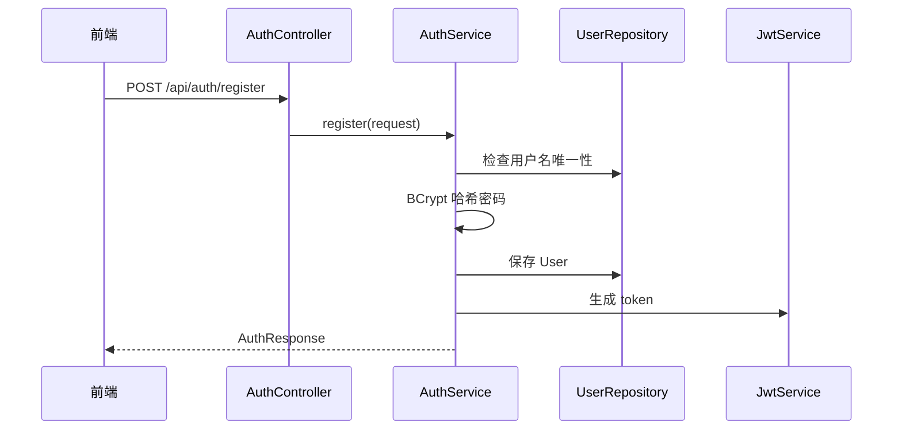
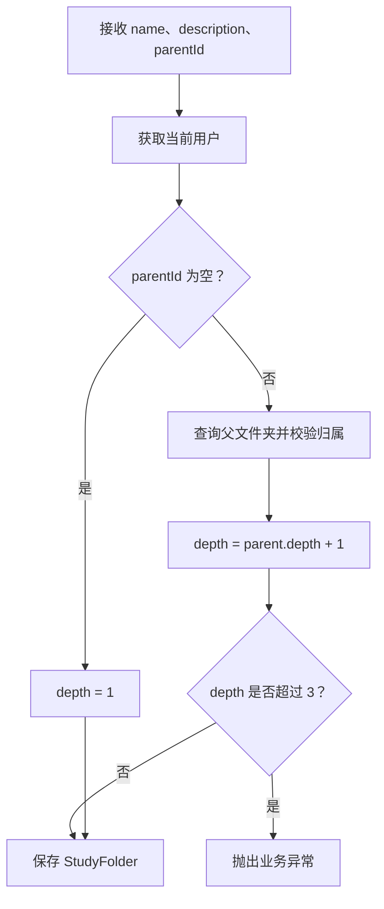
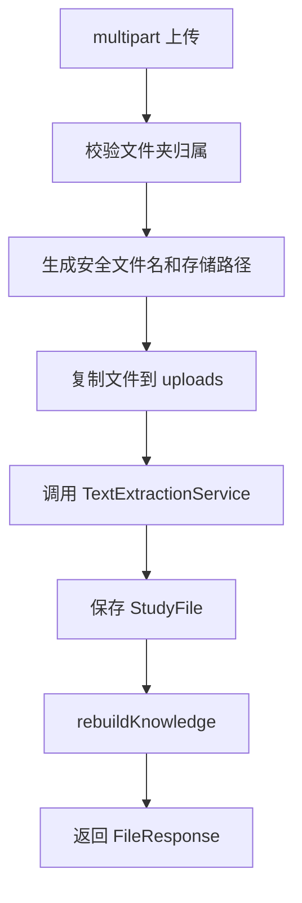
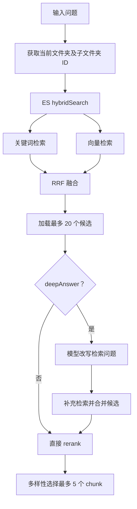
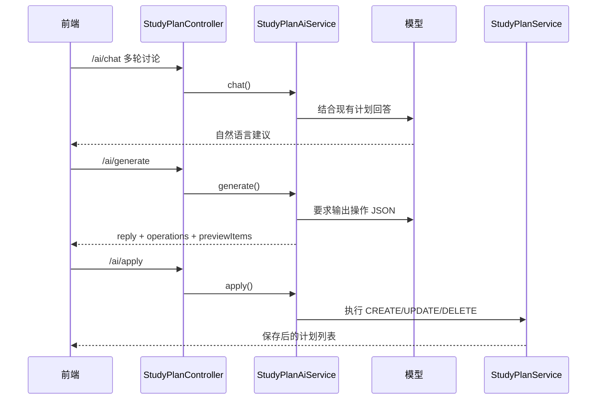
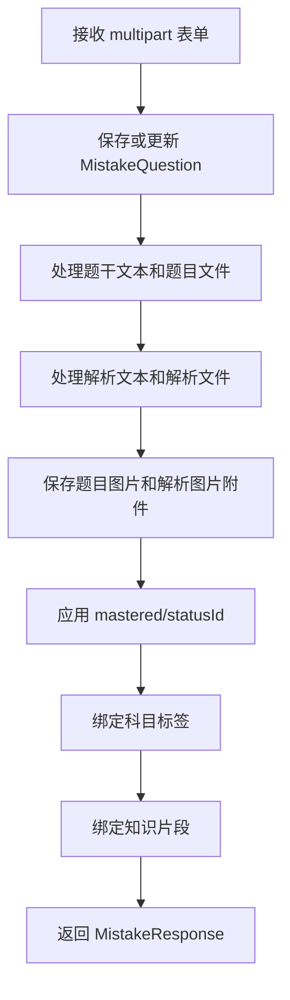

# 智能考研系统详细设计说明书

## 1. 文档说明

本文档描述智能考研系统当前实现的详细设计，包括主要类、输入输出、核心算法、处理流程和边界策略。内容依据 `backend/src/main/java/com/example/exam` 与 `frontend/src` 的现有代码编写。

## 2. 认证与安全模块

### 2.1 相关类

| 类 | 职责 |
| --- | --- |
| `AuthController` | 暴露注册和登录接口 |
| `AuthService` | 用户注册、密码校验、登录响应生成 |
| `JwtService` | 生成和解析 JWT |
| `JwtAuthenticationFilter` | 从请求头解析 Bearer token 并写入认证上下文 |
| `SecurityConfig` | 配置无状态会话、CORS、放行注册登录、注册密码编码器 |
| `CurrentUserService` | 获取当前登录用户 |

### 2.2 注册流程



### 2.3 登录流程

登录时后端按用户名查询用户，使用 BCrypt 校验密码。校验通过后返回 `AuthResponse(token, userId, username, displayName)`。前端把 token 和用户信息写入 `localStorage`，后续请求由 `api/client.js` 自动附加 `Authorization` 头。

## 3. 学习档案模块

### 3.1 相关类

| 类 | 职责 |
| --- | --- |
| `StudyProfileController` | 学习档案读取、首次初始化、更新 |
| `StudyProfileService` | 维护考研日期、学科文件夹和兼容旧账号 |
| `UserStudyProfile` | 保存 `examDate`、`onboarded`、`subjectCount` |
| `StudyFolder` | 一级学科文件夹通过 `subjectFolder` 和 `subjectOrder` 标记 |

### 3.2 初始化逻辑

`/api/study-profile/onboarding` 接收考研日期和学科名称列表。后端清理并校验学科名，为每个学科创建或复用一级文件夹，设置为学科文件夹。初始化完成后，前端进入工作台。

旧账号缺少 `UserStudyProfile` 时，系统会读取已有一级文件夹：如果存在，则生成学习档案并把一级文件夹标记为学科；如果不存在，则要求用户进入初始化页。

## 4. 文件夹模块

### 4.1 数据结构

`StudyFolder` 包含 `owner`、`parent`、`name`、`description`、`depth`、`subjectFolder`、`subjectOrder`、`createdAt`。根目录下一级文件夹 `parent=null`，子文件夹深度为父级深度加 1。

### 4.2 创建流程



### 4.3 删除与更新

更新只允许修改名称和描述。删除时服务层校验目标文件夹属于当前用户，并根据子文件夹、文件和业务约束决定是否允许删除。

## 5. 文件与知识库模块

### 5.1 相关类

| 类 | 职责 |
| --- | --- |
| `FileController` | 文件列表、上传、查看、编辑、移动、删除、知识库状态 |
| `FileService` | 文件保存、名称处理、知识片段重建、ES 重建触发 |
| `TextExtractionService` | PDF/Word/图片/文本抽取 |
| `StudyFileRepository` | 文件查询 |
| `KnowledgeChunkRepository` | 知识片段查询和删除 |
| `ElasticsearchService` | 异步索引重建和混合检索 |

### 5.2 上传处理



上传文件默认 `knowledgeEnabled=true`，因此保存后会立刻进入知识片段重建。若用户后续移出知识库，则删除该文件的 chunk；重新加入时再重建。

### 5.3 文本抽取

| 文件类型 | 处理方式 |
| --- | --- |
| PDF | PDFBox |
| DOCX | Apache POI XWPF |
| DOC | Apache POI HWPF |
| 图片 | Tesseract OCR 命令 |
| TXT/Markdown | 按文本读取 |
| 其他 | 返回不支持或抽取失败提示 |

`TextExtractionService` 对压缩结构类文档设置文件数量、单项大小、文本大小和膨胀比例限制，降低异常文档带来的风险。

### 5.4 知识片段切分

`FileService` 当前切片常量：

| 常量 | 值 | 说明 |
| --- | --- | --- |
| `CHUNKING_VERSION` | 2 | 当前切片版本 |
| `MIN_CHUNK_SIZE` | 300 | 小片段合并判断 |
| `TARGET_CHUNK_SIZE` | 800 | 目标片段长度 |
| `MAX_CHUNK_SIZE` | 1100 | 最大片段长度 |

切片流程：

```text
delete chunks by file_id
if knowledgeEnabled is false: return
text = normalize(extractedText)
units = split text into headings, paragraphs and sentences
chunks = merge units by natural semantic boundaries
for each chunk:
    estimate pageNumber by text offset
    save KnowledgeChunk(file, folder, chunkIndex, pageNumber, version, content)
async reindexFile(fileId)
```

切分时优先保持标题、段落、句子和自然停顿，不满足长度时再按最大长度硬切。片段保存后，ES 索引可异步重建；ES 失败不影响主流程。

### 5.5 文件编辑、移动和删除

- 编辑文件文本或标签后，系统重新构建知识片段。
- 移动文件时，系统校验目标文件夹归属，更新 `StudyFile.folder`，同步更新相关 `KnowledgeChunk.folder`，再触发 ES 重建。
- 删除文件时，系统删除数据库记录、知识片段、索引和本地上传文件。

## 6. 知识问答模块

### 6.1 相关类

| 类 | 职责 |
| --- | --- |
| `ChatController` | 普通问答、流式问答、定制练题、反馈、笔记 |
| `ChatService` | 检索、rerank、prompt、模型调用、兜底答案 |
| `ElasticsearchService` | 关键词检索、向量检索、RRF 融合 |
| `EmbeddingService` | 调用 Embedding 接口 |
| `KnowledgeChunkInteractionService` | chunk 引用和反馈统计 |
| `AiSettingsService` | 合并用户设置和后端默认 AI 配置 |

### 6.2 输入模型

`ChatRequest` 包含 `folderId`、`mode`、`question`、模型配置、`withCitations`、`deepAnswer`、`useKnowledgeBase` 等字段。前端通常传当前 UI 设置，后端再与用户级 AI 设置合并。

### 6.3 检索算法



若 ES 不可用、配置关闭或无结果，系统从数据库查询当前文件夹范围内的知识片段，根据关键词命中、文件名命中、上传时间和原始排名进行本地评分。

### 6.4 Rerank 和多样性选择

`ChatService` 对候选片段综合评分，主要考虑：

- 问题关键词在片段内容中的命中次数。
- 关键词出现位置。
- 文件名是否命中关键词。
- 原始检索排名。
- 片段长度是否适合回答。

最终最多选取 5 个片段，并优先保证不同文件的多样性，同一文件初始最多选取 2 个片段。

### 6.5 Prompt 与生成

使用知识库时，系统将片段编号后放入上下文，要求模型优先依据资料回答，资料不足时说明无法确认，开启引用时使用 `[1]`、`[2]` 等标注来源。不使用知识库时，系统构造普通聊天 prompt，不返回来源。

模型调用使用 OpenAI 兼容 Chat Completions 接口。普通知识库回答默认最大 token 约 1600，直接聊天约 2000，深度回答约 2400。流式接口通过 SSE 返回 `delta`、`done` 和 `error` 事件。

### 6.6 兜底策略

| 场景 | 处理 |
| --- | --- |
| 知识库问答无 API Key | 使用检索片段生成本地摘要 |
| 直接聊天无 API Key | 提示用户配置模型或开启知识库 |
| 模型异常 | 知识库场景回退本地摘要 |
| ES 不可用 | 回退数据库检索 |
| 没有知识片段 | 返回资料不足提示 |

## 7. 定制练题设计

定制练题接口为 `/api/chat/teacher/question`。请求包含文件夹、可选学科文件夹、提问要求和 `excludeChunkIds`。后端在限定范围中选择合适 chunk，返回问题、参考答案、来源和 chunkId。

选题评分：

```text
score = relevanceScore * 0.50 + reviewPriority * 0.45 + randomFactor * 0.05
```

其中 `reviewPriority` 综合掌握度、遗忘风险和引用次数。定制题可反馈“很清楚/忘记了”，也可一键加入错题集并保存 chunk 关联。

## 8. 学习画像模块

### 8.1 掌握度计算

`KnowledgeChunk.getMasteryRate()` 使用平滑公式：

```text
masteryRate = (correctHitCount + 2.5) / (correctHitCount + 1.2 * wrongHitCount + 5.0)
```

只有发生过正确或错误反馈的片段才计入覆盖率。引用次数用于表示关注度，最近访问和最近练习用于遗忘风险判断。

### 8.2 聚合指标

`KnowledgeProfileService` 提供：

- 总览：总片段、已练习片段、覆盖率、整体掌握度、引用、正确/错误反馈、薄弱点、高风险点、考研倒计时。
- 学科画像：按一级学科文件夹及子文件夹聚合。
- 文件画像：按资料文件聚合，可按学科过滤。
- 薄弱点：按复习优先级排序。
- 趋势和活动：按天统计引用、练习、正确、错误、错题练习。
- 风险：高风险 chunk、复习压力趋势和风险气泡。
- 诊断：规则诊断为基础，AI 可用时补充总结。

复习优先级：

```text
forgetRisk = min(1, daysSinceLastPracticed / 14)
attentionScore = normalized(log(1 + citeCount))
reviewPriority = (1 - masteryRate) * 0.6 + forgetRisk * 0.25 + attentionScore * 0.15
```

## 9. 学习计划模块

### 9.1 手动计划

`StudyPlanService` 支持按日期范围查询、创建、更新和删除。保存前执行标题清理、必填校验、时间校验、枚举默认值处理，并按当前用户保存。

计划字段包括标题、科目、说明、类型、日期、开始时间、结束时间、地点、优先级、状态和来源。手动创建来源为 `MANUAL`，AI 应用创建来源为 `AI`。

### 9.2 AI 规划



AI 只生成草稿，前端展示预览，用户确认后才调用 apply 写入数据库。

## 10. 错题模块

### 10.1 相关类

| 类 | 职责 |
| --- | --- |
| `MistakeController` | 错题、状态、标签、附件、练习接口 |
| `MistakeService` | 错题创建更新、附件保存、状态标签、随机练习和回写 |
| `MistakeQuestion` | 错题主实体 |
| `MistakeAttachment` | 题目/解析图片附件 |
| `MistakeStatus` | 自定义掌握状态 |
| `MistakeSubjectTag` | 科目标签 |
| `MistakeQuestionChunk` | 错题与知识片段关联 |

### 10.2 创建和更新流程



题目文件和解析文件可保存原始文件，图片附件按 `MistakeAttachmentType.QUESTION` 或 `SOLUTION` 分类。文件识别接口复用 `TextExtractionService`。

### 10.3 状态和标签

- `mastered=true` 表示完全掌握。
- `mastered=false` 且有自定义状态时显示自定义状态。
- `mastered=false` 且无状态时显示“未掌握”。
- 已被错题使用的状态或标签不能删除。
- 一级学科文件夹可同步为同名科目标签。

### 10.4 随机练习和回写

随机练习从未完全掌握的错题中按数量和标签抽取。用户记录练习结果后：

- 写对：关联 chunk 增加 `correctHitCount`。
- 写错：关联 chunk 增加 `wrongHitCount`。
- 两种情况都会更新 `lastPracticedAt` 和 `lastAccessedAt`。
- 没有关联 chunk 时仍返回成功，但 `updatedChunkCount=0`。
- 系统不自动把错题改为完全掌握，避免一次练习结果误改长期状态。

## 11. AI 设置模块

`AiSettingsService` 保存和读取 `UserAiSettings`，字段包括 AI 角色、系统提示词、聊天模型、聊天 Endpoint、聊天 API Key、Embedding 模型、Embedding Endpoint、Embedding API Key、Embedding 维度和预设 JSON。前端也会在本地保存 AI 设置快照，便于快速恢复 UI。

后端默认配置可从 `application.yml` 读取。正式部署时应避免将真实密钥写入仓库，并对数据库中的 API Key 加密。

## 12. 前端详细设计

### 12.1 页面状态

`useSmartExamApp.js` 管理全局状态，包括登录态、学习档案、文件夹、文件、问答消息、知识画像数据、计划、错题、AI 设置和 UI 选中状态。

主要页面：

| 页面 key | 页面 |
| --- | --- |
| `home` | 首页 |
| `knowledge` | 我的知识库入口 |
| `library` | 我的资料 |
| `chat` | 知识问答 |
| `editor` | 上传编辑 |
| `profile` | 知识画像 |
| `planner` | 学习规划 |
| `mistakes` | 错题集 |
| `personal` | 个人设置 |
| `settings` | AI 设置 |

知识库内部模块：`library`、`chat`、`editor`。学习规划内部模块：`manual`、`ai`。错题内部模块：`upload`、`practice`、`browse`。

### 12.2 API 封装

`api/client.js` 提供：

- `api()`：普通 JSON 和 FormData 请求。
- `streamApi()`：SSE 流式请求解析。
- `authApi`、`studyProfileApi`、`folderApi`、`fileApi`、`chatApi`、`knowledgeProfileApi`、`aiSettingsApi`、`studyPlanApi`、`mistakeApi`。

所有请求自动附加 token。非 FormData 请求自动设置 `Content-Type: application/json`。

## 13. 详细设计结论

系统核心链路为“资料上传 -> 文本抽取 -> 知识切片 -> 检索问答 -> 来源反馈 -> 知识画像 -> 定制练题/错题/计划复习”。各模块通过实体关联和服务层调用形成闭环，同时保留 ES、OCR、AI 等增强服务的降级策略，整体实现与当前毕业设计目标匹配。
