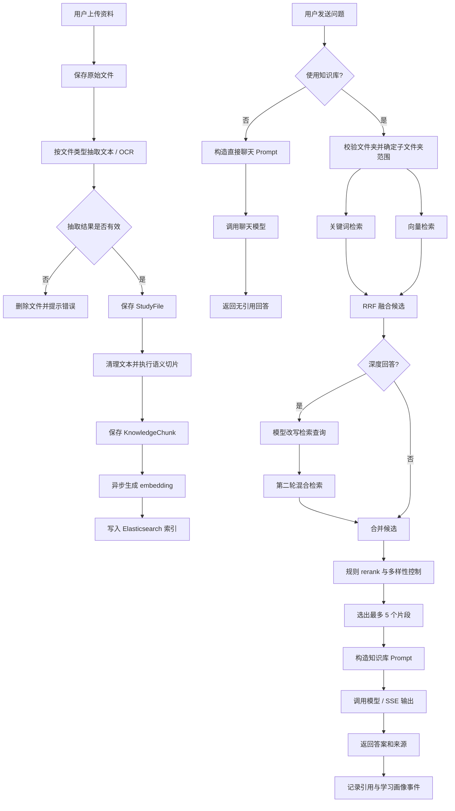

# 知识问答全过程说明

本文档说明当前项目中知识库问答的完整链路，包括资料上传、文本抽取、语义切片、检索召回、规则 rerank、Prompt 构造、大模型调用、来源引用和学习画像回写。

## 一、总体方案

本项目的知识问答采用“混合检索增强生成”（RAG）方案。系统不会直接把用户问题交给大模型自由回答，而是先在当前文件夹及其子文件夹范围内检索相关 `KnowledgeChunk`，再把候选片段作为上下文交给大模型生成答案。

当前问答模块支持三类路径：

1. 答疑助手：默认使用知识库，检索资料片段后生成可追溯回答。
2. 深度回答：在普通检索外增加一轮模型查询改写和补充检索，适合综合题、比较题和口语化问题。
3. 直接聊天：用户关闭“使用知识库”后跳过资料检索，直接调用聊天模型，不返回来源引用。

定制练题由独立接口 `/api/chat/teacher/question` 提供。它固定使用知识库和来源追溯，每次围绕一个被选中的知识片段生成练习问题，并把反馈结果回写到知识片段统计中。

## 二、前端交互流程

知识问答页面位于 `frontend/src/views/ChatView.vue`，共享状态与主要动作在 `frontend/src/composables/useSmartExamApp.js` 中维护，接口封装位于 `frontend/src/api/client.js`。

答疑助手下，页面提供三个控制项：

- 使用知识库：默认开启。开启时需要选择文件夹；关闭后允许不选文件夹直接聊天。
- 引用来源：默认开启。开启时，答案中的 `[1]`、`[2]` 等编号会渲染为可点击来源按钮。
- 深度回答：默认关闭。开启后，后端会额外做查询改写和第二轮检索。

前端发送普通问答时，会合并 AI 设置、当前表单和当前文件夹 ID：

```json
{
  "folderId": 1,
  "mode": "QA",
  "question": "什么是存储器",
  "useKnowledgeBase": true,
  "withCitations": true,
  "deepAnswer": false,
  "chatModel": "deepseek-chat",
  "chatEndpoint": "...",
  "chatApiKey": "...",
  "embeddingModel": "...",
  "embeddingEndpoint": "...",
  "embeddingApiKey": "...",
  "embeddingDimensions": 1536
}
```

流式接口优先使用 `/api/chat/stream`。如果流式请求失败且尚未收到有效增量内容，前端会回退到普通 `/api/chat`。

## 三、资料上传与知识库构建

### 1. 文件上传与文本抽取

用户在上传编辑页上传 PDF、Word、图片、文本或 Markdown 资料。后端 `FileService.upload()` 保存原始文件到本地上传目录，调用 `TextExtractionService.extract()` 抽取文本，并保存 `StudyFile`。

文本抽取方式：

- PDF：使用 PDFBox。
- Word：使用 Apache POI。
- 图片：调用本机 Tesseract OCR。
- 文本、Markdown、HTML：直接读取或转为可检索文本。

当前实现中，如果自动抽取结果是占位错误文本，上传接口会删除刚保存的文件并抛出异常，避免无效占位内容直接进入知识库。抽取成功后文件默认 `knowledgeEnabled = true`，随后立即重建知识片段。

对应代码：

- `backend/src/main/java/com/example/exam/service/FileService.java`
- `backend/src/main/java/com/example/exam/service/TextExtractionService.java`

### 2. 语义切片

当前切片方案已经升级为 `chunkingVersion = 2`，不再使用固定 `800` 字符窗口和 `120` 字符重叠。

`FileService.rebuildKnowledge()` 的实际策略是：

- 先把 HTML 转为可检索文本，清理脚本、样式和多余空白。
- 按行、标题、句子和软分隔符拆成 `TextUnit`。
- 标题、段落开头、自然停顿和新话题词会影响切片边界。
- 目标长度约 `800` 字符，最小有效尾段约 `300` 字符，最大约 `1100` 字符。
- 重叠策略为“上一片段末尾的 1 个非标题句子”，而不是固定字符数。
- 页码按文本偏移估算，当前约每 `3500` 字符折算一页。
- 片段保存 `file`、`folder`、`chunkIndex`、`pageNumber`、`chunkingVersion` 和 `content`。

应用启动后，`backfillKnowledgeForExistingFiles()` 会检查已开启知识库的历史文件；如果片段为空、页码需要修复，或 `chunkingVersion` 低于当前版本，会自动重建。

对应代码：

- `FileService.rebuildKnowledge()`
- `FileService.splitIntoSemanticChunks()`
- `KnowledgeChunk`
- `docs/09-semantic-chunking-design.md`

## 四、异步 Embedding 与 Elasticsearch 索引

知识片段写入数据库后，系统调用：

```java
elasticsearchService.reindexFile(userId, file, chunks, aiSettingsService.get(userId));
```

`ElasticsearchService.reindexFile()` 会先复制文件和片段快照，再用 `CompletableFuture.runAsync()` 异步执行索引重建。因此上传、编辑或移入知识库的接口不需要等待 embedding 和 Elasticsearch 写入完成。

Elasticsearch 文档字段包括：

- `chunkId`
- `fileId`
- `folderId`
- `userId`
- `fileName`
- `chunkIndex`
- `content`
- `uploadedAt`
- `embedding`

`embedding` 使用 `dense_vector`，维度来自用户设置；未配置时使用系统默认维度。embedding 生成失败或未配置 API Key 时，文档仍可通过关键词检索参与召回。

对应代码：

- `ElasticsearchService.reindexFile()`
- `ElasticsearchService.ensureIndex()`
- `EmbeddingService.embed()`

## 五、提问后的后端流程

普通问答入口：

- `ChatController.ask()` -> `ChatService.ask()`
- `ChatController.askStream()` -> `ChatService.askStream()`

后端先判断 `useKnowledgeBase`。该字段为空时默认视为开启。

### 1. 使用知识库

当 `useKnowledgeBase = true` 时：

1. 校验 `folderId` 存在且属于当前用户。
2. 合并用户保存的 AI 设置和本次请求覆盖项。
3. 确定检索范围为当前文件夹及其所有子文件夹。
4. 调用 Elasticsearch 混合检索。
5. 若开启深度回答，调用聊天模型改写查询并执行第二轮检索。
6. 合并候选片段，最多保留 `20` 个候选。
7. 执行规则 rerank 和多样性控制，最终最多选出 `5` 个片段。
8. 构造知识库 Prompt，调用模型或流式模型。
9. 如果模型无返回，回退成本地检索摘要。
10. 开启引用时构造来源列表，并记录引用事件。

### 2. 不使用知识库

当 `useKnowledgeBase = false` 时：

1. 不校验文件夹。
2. 不执行检索。
3. 构造直接聊天 Prompt。
4. 调用聊天模型。
5. 不返回来源引用。

如果没有配置聊天模型 API Key，系统会提示用户配置模型服务或重新开启知识库。因为此时没有检索片段，无法使用本地知识库摘要兜底。

## 六、混合检索机制

`ElasticsearchService.hybridSearch()` 同时尝试关键词检索和向量检索：

- 关键词检索使用 `multi_match`，字段为 `content^3` 和 `fileName`。
- 向量检索在 embedding 可用时使用 Elasticsearch `knn`。
- 两路召回各取 `20` 个候选。
- 使用 RRF（Reciprocal Rank Fusion）融合排序，最终返回最多 `20` 个 chunk ID。

如果 Elasticsearch 未启用、请求失败或短时间内被标记为不可用，`ChatService.retrieve()` 会回退到数据库片段本地评分：读取范围内所有可用 `KnowledgeChunk`，按问题关键词命中分数排序，再进入同一套 rerank 和多样性控制。

对应代码：

- `ElasticsearchService.hybridSearch()`
- `ElasticsearchService.keywordSearch()`
- `ElasticsearchService.vectorSearch()`
- `ElasticsearchService.reciprocalRankFusion()`
- `ChatService.retrieve()`

## 七、规则 Rerank 与多样性控制

召回阶段可以拿更多候选，但最终进入 Prompt 的片段需要控制数量。当前常量为：

- `MAX_RERANK_CANDIDATES = 20`
- `MAX_RETRIEVED_CHUNKS = 5`
- `MAX_INITIAL_CHUNKS_PER_FILE = 2`

规则 rerank 会综合：

- 问题关键词在片段内容中的命中情况。
- 命中词在内容中出现的位置，越靠前加分越多。
- 文件名是否命中较长关键词。
- 原始召回排名。
- 片段长度是否足以承载完整信息。

多样性控制分三步：

1. 优先从不同文件各选一个片段。
2. 数量不足时允许同一文件最多先选 `2` 个片段。
3. 仍不足时按 rerank 顺序补齐。

对应代码：

- `ChatService.rerankAndDiversify()`
- `ChatService.rerankScore()`
- `ChatService.diversifyChunks()`

## 八、深度回答流程

深度回答由 `deepAnswer = true` 开启，仅在使用知识库时生效。

流程：

1. 使用原问题执行第一轮混合检索。
2. 调用聊天模型生成一条适合检索的查询语句。
3. 清理改写结果中的编号、引号和多余空白。
4. 如果改写查询与原问题不同，执行第二轮混合检索。
5. 合并两轮候选，去重并保留前 `20` 个。
6. 用“原问题 + 改写查询”共同参与 rerank。
7. 最终选出最多 `5` 个片段生成回答。

查询改写的输出上限为 `120` tokens，目标是提升召回，而不是提前回答问题。

对应代码：

- `ChatService.buildDeepSearchQuery()`
- `ChatService.mergeCandidates()`

## 九、Prompt 构造方式

### 1. 使用知识库时

系统把最终片段编号后拼入 Prompt：

```text
资料片段 [1]
文件：xxx.pdf
页码：第 2 页
内容：
...
```

开启引用时，Prompt 要求模型在每个定义、分类、结论或例子后紧跟 `[1]`、`[2]` 等来源编号，不把引用集中堆在末尾。关闭引用时，Prompt 仍要求只依据知识库回答，但明确不要输出引用编号或文末参考列表。

### 2. 不使用知识库时

直接聊天 Prompt 会说明用户已选择不引用知识库，要求模型直接基于通用能力回答，不输出资料引用编号，不确定时明确说明。

对应代码：

- `ChatService.buildPrompt()`
- `ChatService.buildDirectPrompt()`
- `ChatService.numberedContext()`

## 十、大模型调用与输出长度

系统兼容 OpenAI Chat Completions 风格接口。Endpoint 会自动规整：

- 以 `/chat/completions` 结尾时直接使用。
- 以 `/v1` 或 `/compatible-mode/v1` 结尾时自动追加 `/chat/completions`。
- 未填写时默认使用 `https://api.openai.com/v1/chat/completions`。

当前输出上限：

- 普通知识库问答：`1600` tokens
- 直接聊天：`2000` tokens
- 深度回答：`2400` tokens
- 查询改写：`120` tokens
- 定制练题出题：`900` tokens
- 普通请求超时：`90` 秒
- SSE emitter 超时：`180` 秒

对应代码：

- `ChatService.callModel()`
- `ChatService.callModelStream()`
- `ChatService.responseTokenLimit()`

## 十一、来源引用与学习画像回写

当开启引用时，后端会把最终进入 Prompt 的片段转换为 `Source` 列表。每个来源包含：

- 引用编号
- chunk ID
- 文件 ID
- 文件夹 ID
- 文件名
- 页码
- 上下文摘要
- 引用次数
- 正确命中次数
- 错误命中次数
- 掌握度
- 最近访问时间
- 最近练习时间

返回前，`KnowledgeChunkInteractionService.recordCitations()` 会校验 chunk 归属，增加 `citeCount`，更新 `lastAccessedAt`，并写入 `KnowledgeChunkEvent` 的 `CITED` 事件。用户在来源弹窗或定制题中点击“很清楚 / 忘记了”时，会增加正确或错误命中次数，并刷新最近练习时间。

这些数据会被知识画像、薄弱知识点、定制练题选题和错题练习闭环使用。

对应代码：

- `ChatService.buildSources()`
- `KnowledgeChunkInteractionService.recordCitations()`
- `KnowledgeChunkInteractionService.recordFeedback()`
- `KnowledgeProfileService`

## 十二、定制练题

定制练题的请求入口是 `/api/chat/teacher/question`，前端由 `requestTeacherQuestion()` 调用。它不使用普通问答表单中的“使用知识库 / 引用来源 / 深度回答”开关，而是固定在知识库范围内出题。

后端流程：

1. 校验当前文件夹或用户选择的学科文件夹。
2. 读取范围内可用知识片段。
3. 排除本轮已问过的 `excludeChunkIds`，若全部问过则允许重新使用候选。
4. 按相关性、引用次数、掌握度和遗忘风险选择片段。
5. 记录一次引用。
6. 调用模型基于该片段生成 `question` 和 `referenceAnswer`。
7. 返回问题、参考答案、来源和 `chunkId`。

定制题可以直接加入错题集，并与来源 chunk 关联。后续刷错题时，“写对了 / 写错了”会回写相关 chunk 的学习统计。

对应代码：

- `ChatService.teacherQuestion()`
- `ChatService.selectTeacherChunk()`
- `MistakeService.createFromTeacherQuestion()`
- `MistakeService.recordPracticeResult()`

## 十三、降级与兜底策略

系统设计了多个兜底场景：

- 未配置 embedding API Key：跳过向量生成和向量检索，仍可使用关键词检索与数据库本地评分。
- Elasticsearch 不可用：短暂标记不可用，后续一段时间跳过 ES，回退到数据库 `KnowledgeChunk` 本地评分。
- 未配置聊天模型 API Key：使用知识库时返回本地检索摘要；直接聊天时提示配置模型或开启知识库。
- 模型接口异常或空返回：使用知识库时回退本地摘要；直接聊天时提示检查 API Key、模型名和 Endpoint。
- 上传文本抽取失败：拒绝保存无效占位资料，提示用户处理 OCR 或文件内容问题。

对应代码：

- `ChatService.localAnswer()`
- `ChatService.localDirectAnswer()`
- `ElasticsearchService.markTemporarilyUnavailable()`
- `TextExtractionService.isExtractionPlaceholder()`

## 十四、完整流程图



## 十五、核心文件

后端：

- `backend/src/main/java/com/example/exam/dto/ChatDtos.java`
- `backend/src/main/java/com/example/exam/controller/ChatController.java`
- `backend/src/main/java/com/example/exam/service/ChatService.java`
- `backend/src/main/java/com/example/exam/service/FileService.java`
- `backend/src/main/java/com/example/exam/service/TextExtractionService.java`
- `backend/src/main/java/com/example/exam/service/ElasticsearchService.java`
- `backend/src/main/java/com/example/exam/service/EmbeddingService.java`
- `backend/src/main/java/com/example/exam/service/KnowledgeChunkInteractionService.java`
- `backend/src/main/java/com/example/exam/model/KnowledgeChunk.java`
- `backend/src/main/java/com/example/exam/model/KnowledgeChunkEvent.java`

前端：

- `frontend/src/views/ChatView.vue`
- `frontend/src/composables/useSmartExamApp.js`
- `frontend/src/api/client.js`
- `frontend/src/styles/knowledge-editor.css`
- `frontend/src/styles/profile-settings.css`
- `frontend/src/styles/responsive.css`

相关扩展文档：

- `docs/08-learning-profile-teacher-mistake-upgrade.md`
- `docs/09-semantic-chunking-design.md`
- `docs/09-knowledge-profile-enhancement.md`

## 十六、答辩表述建议

可以这样概括当前系统的知识问答机制：

> 本系统采用面向个人考研资料的混合检索增强生成方案。资料上传后，系统先抽取文本，再基于标题、段落和句子边界切分为语义完整的知识片段，并异步生成 embedding 写入 Elasticsearch。用户提问时，系统在当前文件夹及其子文件夹范围内同时执行关键词检索和向量检索，通过 RRF 融合得到候选片段，再使用规则 rerank 和片段多样性控制选出最多 5 个片段交给大模型生成回答。答案可返回来源引用，引用和用户反馈会回写知识片段统计，并进一步服务知识画像、定制练题选题和错题复盘闭环。
