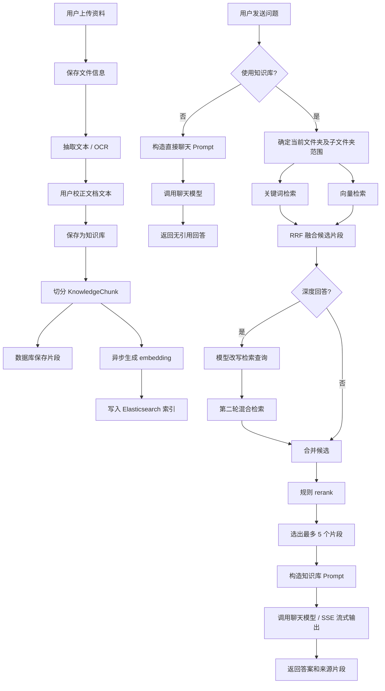

# 知识问答全过程说明

本文档整理本次对知识问答模块的改造内容，并说明系统从资料上传、知识库构建、问题检索到大模型生成答案的完整流程。

## 一、总体方案

本项目的知识问答采用“混合检索增强生成”方案，也就是轻量级 RAG。

系统不会直接把用户问题交给大模型自由回答，而是先从当前文件夹知识库中检索相关资料片段，再把检索结果作为上下文交给大模型生成答案。这样可以让回答尽量依据用户上传的资料，并支持返回来源引用。

本次改造后，系统支持三种问答路径：

1. 快速知识库问答：默认模式，检索知识库后生成答案。
2. 深度回答：用户手动开启，会额外进行一轮查询改写和补充检索，提高复杂问题的召回效果。
3. 直接聊天：用户关闭“使用知识库”后，不检索资料，直接与大模型对话。

## 二、前端交互流程

知识问答页面新增三个控制项：

- 使用知识库：默认开启。开启时，问题会进入知识库检索流程；关闭时，直接调用大模型聊天。
- 引用来源：默认开启。开启时，答案中的 `[1]`、`[2]` 等编号可以点击查看来源片段。
- 深度回答：默认关闭。开启后，系统会多做一次查询改写和补充检索。

前端发送问题时，会把这些参数一起传给后端：

```json
{
  "folderId": 1,
  "mode": "QA",
  "question": "什么是存储器",
  "useKnowledgeBase": true,
  "withCitations": true,
  "deepAnswer": false,
  "chatModel": "deepseek-v4-flash",
  "chatEndpoint": "...",
  "chatApiKey": "...",
  "embeddingModel": "...",
  "embeddingEndpoint": "...",
  "embeddingApiKey": "..."
}
```

对应代码：

- `frontend/src/App.vue`
- `backend/src/main/java/com/example/exam/dto/ChatDtos.java`

## 三、资料上传与知识库构建

### 1. 文件上传

用户在“上传编辑”页面上传 PDF、Word、图片、文本等资料。

后端接收文件后，会保存到本地上传目录，并记录文件信息，例如：

- 文件名
- 文件类型
- 所属文件夹
- 上传时间
- 是否加入知识库

对应代码：

- `FileService.upload()`

### 2. 文本抽取

上传后，系统会从文件中抽取正文：

- PDF 使用 PDF 解析。
- Word 使用 Apache POI。
- 图片使用本地 Tesseract OCR。
- 文本和 Markdown 直接读取内容。

抽取出的文本会显示在前端编辑器中，用户可以手动校正。

对应代码：

- `TextExtractionService`

### 3. 切分知识片段

当文件保存为知识库后，系统会把正文切分为多个 `KnowledgeChunk`。

当前切分策略：

- 每段约 `800` 字符。
- 相邻片段重叠 `120` 字符。
- 根据文本位置计算页码。
- 每个片段保存所属文件、所属文件夹、片段序号和内容。

这样做的目的是避免一次性把整篇资料放进大模型，同时保证检索时可以定位到较小的知识单元。

对应代码：

- `FileService.rebuildKnowledge()`
- `KnowledgeChunk`

## 四、异步 Embedding 与 Elasticsearch 索引

本次方案要求“上传资料时异步生成 embedding，不阻塞用户操作”。项目原有实现已经满足这一点，本次保留并配合新的检索流程使用。

当知识片段生成后，系统会调用：

```java
elasticsearchService.reindexFile(userId, file, chunks, aiSettingsService.get(userId));
```

`reindexFile()` 内部通过 `CompletableFuture.runAsync()` 异步执行索引构建。

也就是说：

- 用户上传或保存资料后，接口可以先返回。
- 后台再慢慢生成 embedding 并写入 Elasticsearch。
- 即使 Elasticsearch 或 embedding 服务暂时不可用，数据库里的知识片段仍然是主数据，不会丢失。

每个 Elasticsearch 文档包含：

- `chunkId`
- `fileId`
- `folderId`
- `userId`
- `fileName`
- `chunkIndex`
- `content`
- `uploadedAt`
- `embedding`

其中 `embedding` 是 `dense_vector` 类型，使用余弦相似度。

对应代码：

- `ElasticsearchService.reindexFile()`
- `ElasticsearchService.reindexFileNow()`
- `EmbeddingService.embed()`

## 五、提问后的检索流程

当用户发送问题时，后端首先判断是否使用知识库。

### 情况一：使用知识库

如果 `useKnowledgeBase = true`，后端会进入 RAG 流程：

1. 校验当前文件夹是否存在且属于当前用户。
2. 读取用户模型配置。
3. 确定检索范围为当前文件夹及其子文件夹。
4. 执行混合检索。
5. 对候选片段进行轻量 rerank。
6. 选出最终片段构造 prompt。
7. 调用大模型生成答案。
8. 返回答案和来源片段。

对应入口：

- `ChatService.ask()`
- `ChatService.askStream()`

### 情况二：不使用知识库

如果 `useKnowledgeBase = false`，后端会跳过文件夹校验和知识库检索，直接构造普通聊天 prompt。

这种模式适合：

- 用户想问通用问题。
- 用户不希望回答受当前资料限制。
- 当前没有选择文件夹，但已经配置了大模型 API。

注意：关闭知识库后，系统不会返回来源引用，也无法使用本地检索兜底回答。

对应代码：

- `ChatService.buildDirectPrompt()`
- `ChatService.localDirectAnswer()`

## 六、混合检索机制

系统的检索由 Elasticsearch 完成，采用关键词检索和向量检索结合的方式。

### 1. 关键词检索

关键词检索使用 Elasticsearch 的 `multi_match`：

- `content` 字段权重更高。
- `fileName` 也参与匹配。
- 适合精确术语、教材名、章节名、定义类问题。

对应代码：

- `ElasticsearchService.keywordSearch()`

### 2. 向量检索

如果用户配置了 embedding API Key，系统会先把用户问题转成向量，再通过 Elasticsearch `knn` 检索相似片段。

向量检索适合：

- 用户问题和资料表述不完全一致。
- 用户使用口语化表达。
- 需要语义相似而不是字面匹配。

对应代码：

- `EmbeddingService.embed()`
- `ElasticsearchService.vectorSearch()`

### 3. RRF 融合排序

关键词检索和向量检索会分别返回候选片段。系统使用 RRF（Reciprocal Rank Fusion）进行融合。

RRF 的作用是：

- 避免只依赖关键词或只依赖向量。
- 如果某个片段在两种检索中排名都靠前，它会获得更高分。
- 对不同检索方式的分数尺度不敏感。

本次修改把 Elasticsearch 融合后的返回数量提升到 `20` 条，为后续 rerank 提供更多候选。

对应代码：

- `ElasticsearchService.reciprocalRankFusion()`

## 七、轻量 Rerank 机制

本次新增了规则 rerank，用于从召回的 `20` 条候选中选出更适合放进 prompt 的片段。

规则 rerank 会综合考虑：

- 片段中是否包含问题关键词。
- 命中词在片段中出现的位置。
- 文件名是否命中关键词。
- Elasticsearch 原始排名。
- 片段长度是否足够承载完整信息。

最终会选出最多 `5` 个片段进入大模型上下文。

这样做的原因是：

- 召回阶段可以尽量多拿候选，避免漏掉相关资料。
- 生成阶段不能无限塞上下文，需要控制 prompt 长度。
- 通过 rerank 可以让进入 prompt 的片段更相关。

对应代码：

- `ChatService.retrieve()`
- `ChatService.rerankAndDiversify()`
- `ChatService.rerankScore()`
- `ChatService.diversifyChunks()`

## 八、片段多样性控制

系统不会简单地取 rerank 后的前 5 条，而是会做片段多样性控制。

选择策略：

1. 优先从不同文件中各取一个片段。
2. 如果数量不足，再允许同一文件取多个片段。
3. 每个文件初始最多取 `2` 个片段。

这样可以避免答案完全依赖单一文件，也有利于多资料交叉引用。

对应代码：

- `ChatService.diversifyChunks()`

## 九、深度回答流程

“深度回答”是可选模式，默认关闭。

开启后，系统会多做一轮检索：

1. 先用用户原问题执行一次混合检索。
2. 调用大模型生成一条更适合检索的查询语句。
3. 使用改写后的查询再执行一次混合检索。
4. 合并两轮候选片段。
5. 再执行规则 rerank。
6. 选出最终 `5` 个片段生成回答。

查询改写 prompt 的目标是保留关键概念、同义表达和教材术语，而不是回答问题。

深度回答的优点：

- 更适合综合题、比较题、跨章节问题。
- 能提高口语化问题的召回率。
- 对资料表述和用户提问不一致的情况更友好。

深度回答的代价：

- 会额外调用一次聊天模型。
- 会额外执行一次检索。
- 响应时间会比普通模式更长。

对应代码：

- `ChatService.buildDeepSearchQuery()`
- `ChatService.mergeCandidates()`

## 十、Prompt 构造方式

### 1. 使用知识库时

系统会把最终选出的片段编号后拼入 prompt。

prompt 中会要求模型：

- 只依据知识库内容回答。
- 如果资料不足，要说明无法从当前知识库确认。
- 开启引用时，每个关键结论后要带上 `[1]`、`[2]` 这类来源编号。
- 不要把所有引用集中放在末尾。

对应代码：

- `ChatService.buildPrompt()`
- `ChatService.numberedContext()`

### 2. 不使用知识库时

系统会构造普通聊天 prompt。

prompt 中会明确说明：

- 用户已选择不引用知识库。
- 直接基于大模型通用能力回答。
- 不输出资料引用编号。
- 不确定时要说明不确定。

对应代码：

- `ChatService.buildDirectPrompt()`

## 十一、大模型调用与流式输出

系统支持两种回答方式：

1. 普通 HTTP 调用：`/api/chat`
2. SSE 流式调用：`/api/chat/stream`

前端优先使用流式接口。流式调用时，后端会边接收模型输出，边通过 SSE 把增量内容推给前端。

前端如果流式调用失败，会回退到普通接口。

对应代码：

- `ChatService.callModel()`
- `ChatService.callModelStream()`
- `ChatController.ask()`
- `ChatController.askStream()`
- `frontend/src/api/client.js`
- `frontend/src/App.vue`

## 十二、回答长度修复

在测试中发现，知识问答有时会回答不全。例如答案正在列举知识点时突然停在一个孤立的 `*`。

原因是原先模型调用参数：

```json
{
  "max_tokens": 600
}
```

这个输出上限偏小，模型回答稍微详细一些就可能被截断。

本次修复后：

- 普通知识库问答：`1600` tokens
- 直接聊天：`2000` tokens
- 深度回答：`2400` tokens
- 查询改写：`120` tokens
- 请求超时：从 `45` 秒提高到 `90` 秒

这样既能避免普通回答过早截断，又能给深度回答留出更完整的输出空间。

对应代码：

- `DEFAULT_CHAT_MAX_TOKENS`
- `DIRECT_CHAT_MAX_TOKENS`
- `DEEP_CHAT_MAX_TOKENS`
- `QUERY_REWRITE_MAX_TOKENS`
- `CHAT_TIMEOUT`

## 十三、来源引用机制

如果用户开启“引用来源”，后端会把最终进入 prompt 的片段转换成 `Source` 列表返回给前端。

每个来源包含：

- 引用编号
- 文件 ID
- 文件夹 ID
- 文件名
- 页码
- 片段摘要

前端会识别答案中的 `[1]`、`[2]` 等编号，并渲染为可点击按钮。

用户点击编号后，可以查看对应来源片段；双击来源弹窗可以打开完整文件并定位相关页。

对应代码：

- `ChatService.buildSources()`
- `ChatService.contextualExcerpt()`
- `frontend/src/App.vue`

## 十四、降级与兜底策略

系统设计了多个兜底场景。

### 1. 未配置 embedding API Key

如果没有 embedding API Key：

- 保存资料时不会生成向量。
- 提问时不会执行向量检索。
- 系统仍然可以使用关键词检索和本地数据库排序。

### 2. Elasticsearch 不可用

如果 Elasticsearch 请求失败：

- 系统会短暂标记 Elasticsearch 不可用。
- 后续一段时间跳过 ES 检索。
- 回退到数据库中的知识片段和本地关键词评分。

### 3. 未配置聊天模型 API Key

如果没有聊天模型 API Key：

- 使用知识库时，系统会根据本地检索结果生成简易摘要。
- 不使用知识库时，系统无法直接聊天，会提示用户配置模型服务或重新开启知识库。

### 4. 模型接口无返回

如果模型接口异常或返回空内容：

- 使用知识库时，系统回退到本地检索摘要。
- 不使用知识库时，系统提示检查 API Key、模型名和 Endpoint。

对应代码：

- `ChatService.localAnswer()`
- `ChatService.localDirectAnswer()`
- `ElasticsearchService.markTemporarilyUnavailable()`

## 十五、完整流程图



## 十六、核心改造文件

本次改造涉及以下文件：

- `backend/src/main/java/com/example/exam/dto/ChatDtos.java`
  - 新增 `useKnowledgeBase` 和 `deepAnswer` 请求参数。
  - `folderId` 改为可为空，以支持不选择文件夹时直接聊天。

- `backend/src/main/java/com/example/exam/service/ElasticsearchService.java`
  - 混合检索融合结果从原先较少数量提升为 `20` 条候选。

- `backend/src/main/java/com/example/exam/service/ChatService.java`
  - 新增直接聊天分支。
  - 新增深度回答查询改写。
  - 新增候选合并和规则 rerank。
  - 最终选取 `5` 个片段进入 prompt。
  - 提高模型输出 token 上限，修复回答不完整问题。

- `frontend/src/App.vue`
  - 新增“使用知识库”“引用来源”“深度回答”三个选项。
  - 关闭知识库后允许不选择文件夹直接聊天。
  - 根据不同模式显示不同输入提示和加载提示。

- `frontend/src/styles.css`
  - 新增聊天选项区域样式。

## 十七、答辩表述建议

可以这样概括本系统的知识问答机制：

> 本系统采用基于 Elasticsearch 的混合检索增强生成方案。资料上传后，系统会抽取文本并切分为知识片段，再异步生成 embedding 并写入 Elasticsearch。用户提问时，系统在当前文件夹及其子文件夹范围内同时执行关键词检索和向量检索，通过 RRF 融合得到候选片段，再使用轻量规则 rerank 选出最相关的知识片段交给大模型生成回答。系统支持来源引用、深度回答和直接聊天三种模式，既保证知识库问答的可追溯性，也保留了普通大模型对话的灵活性。

